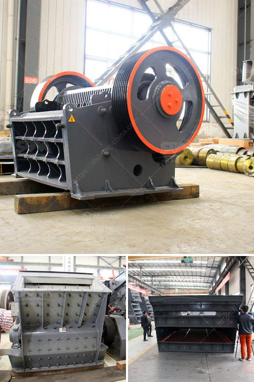

<h3>talc mineral processing</h3>
Talc is a naturally occurring mineral that is known for its softness and smoothness. It is a hydrous magnesium silicate mineral with a chemical formula of Mg3Si4O10(OH)2. In its natural form, talc contains various impurities, ranging from quartz and calcite to iron and manganese oxides. To make it suitable for industrial applications, talc undergoes a series of processing steps.

The first step in talc mineral processing is mining. This can be done through both open-pit mining and underground mining. Once the crude ore is extracted, it is then delivered to the crushing and grinding stage. Here, the ore is reduced to smaller particles by using crushers and mills. The purpose of this step is to liberate the talc mineral from the impurities and to create a suitable feed for the subsequent processing steps.

After the initial crushing and grinding, the talc ore is then subjected to a beneficiation process. This process removes the unwanted impurities and upgrades the talc mineral to a higher purity. Although the specific beneficiation techniques vary depending on the characteristics of the ore, the most common method is froth flotation. In this process, the talc ore is mixed with water and chemicals, such as collectors and frothers, to create a froth. The froth is then separated from the remaining pulp, resulting in a concentrate that is enriched in talc.

The talc concentrate is further processed to meet the desired specifications of different industries. One of the commonly used techniques is dry milling, which involves grinding the talc concentrate into a fine powder. This powder is then classified and packaged in different sizes and grades, depending on the end-use applications. For example, talc powder with a high brightness and low oil absorption is often used in the cosmetic industry, while talc powder with a higher aspect ratio is preferred in the plastics industry.

In addition to dry milling, other techniques like wet milling, calcination, and micronization are also used in talc mineral processing. Wet milling involves grinding the talc in a liquid medium, which helps in reducing the particle size and improving the rheological properties of the final product. Calcination is a thermal treatment process that removes volatile impurities from the talc, creating a purer and more stable mineral. Micronization, on the other hand, involves reducing the particle size of talc to micrometer level using specialized equipment.

In conclusion, talc mineral processing is a complex and multi-step process that involves mining, crushing, grinding, beneficiation, and further processing to produce high-quality talc products. Each step of the process requires careful attention and expertise to ensure that the final product meets the desired specifications. Whether it is used in the cosmetics, plastics, ceramics, or paint industries, talc continues to be an essential mineral with various industrial applications.
<h3>Contact us</h3><ul><li><strong>Whatsapp:&nbsp;<a href="https://wa.me/8613661969651">+8613661969651</a></strong></li><li><a href="https://swt.shibang-china.com/?git&amp;zhl&amp;talc mineral processing"><strong>Online Service(chat now)</strong></a></li></ul><h3>Related</h3><ul><li><a href='buy nigeria stone crusher.md'>buy nigeria stone crusher</a></li><li><a href='calcium carbonate plant sell in india.md'>calcium carbonate plant sell in india</a></li><li><a href='crusher manufacturers in india.md'>crusher manufacturers in india</a></li><li><a href='sand mills for manufacturing.md'>sand mills for manufacturing</a></li><li><a href='cost of limestone crusher plant.md'>cost of limestone crusher plant</a></li></ul>