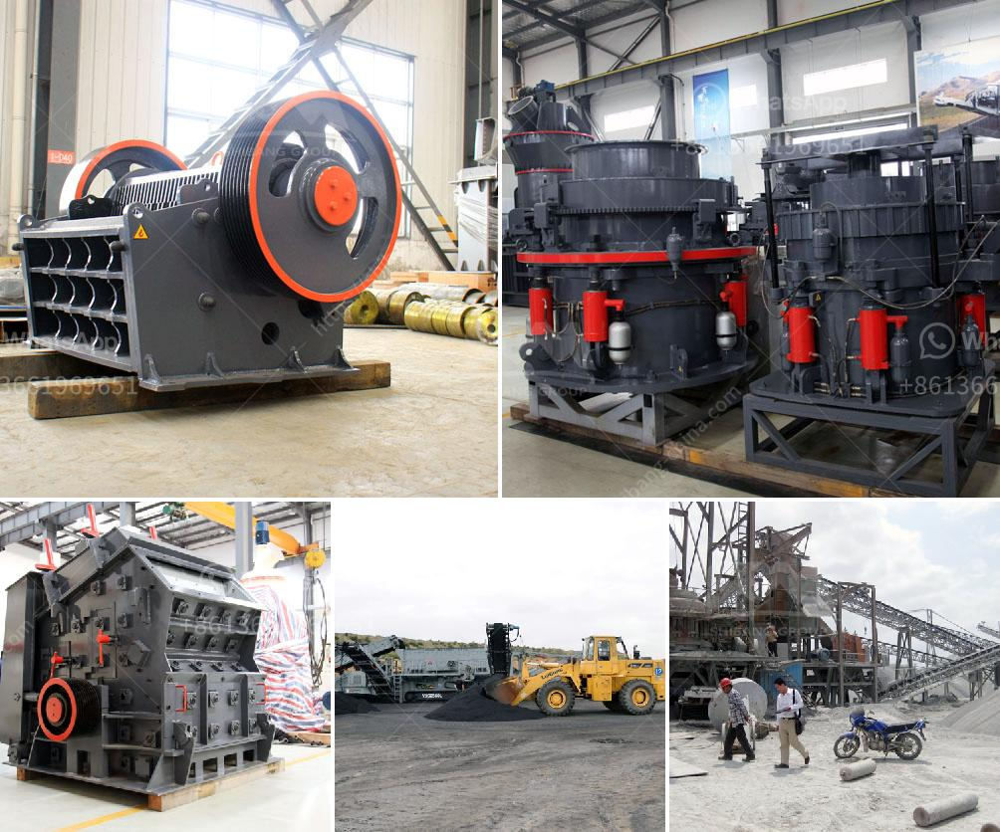

<h3>talc powder crushers</h3>
Talc powder crushers are a crucial piece of machinery used for various industries such as the cosmetics, pharmaceutical, ceramics, and paint industries. These crushers are primarily used to crush talc rocks into powder form, allowing the end-users to utilize the powder for various applications.

Talc, also known as talcum powder, is a mineral composed mainly of magnesium, silicon, and oxygen. It is widely used in various products such as baby powder, body powder, and makeup products due to its ability to absorb moisture, reduce friction, and provide a smooth and silky texture. To achieve the desired particle size and consistency, talc rocks need to be carefully crushed into powder form, requiring the use of talc powder crushers.

The process of crushing talc rocks begins with the extraction of talc ore from the mines. The ore is then refined to remove impurities and sorted into various grades, depending on its quality and intended application. Once the talc is extracted and refined, it is transported to crushing facilities where talc powder crushers come into play.

Talc powder crushers typically consist of jaw crushers or hammer crushers, which effectively break down the talc rocks into smaller, more manageable pieces. These crushers operate by applying pressure to the material, causing it to break under the force. The crushed material is then further processed, either through pulverization or milling, to achieve the desired particle size.

The design and efficiency of talc powder crushers are crucial as the quality of the final powder largely depends on the crushing process. Manufacturers must ensure that the crushers are capable of finely and uniformly crushing the talc rocks without generating excessive heat or causing unwanted changes in the chemical composition of the talc.

Various factors influence the selection of talc powder crushers, including the hardness and size of the talc rocks, the required particle size distribution, and the desired production capacity. Manufacturers must carefully assess these factors and choose crushers that optimize the crushing process for their specific needs.

Apart from the cosmetics industry, talc powder crushers find applications in several other industries. For example, the pharmaceutical industry utilizes talc powder as an excipient, or a substance that is added to medications to improve their production and performance. Talc powder crushers ensure the consistent and effective blending of talc powder with other active ingredients, enabling the production of high-quality pharmaceutical products.

Similarly, the ceramics and paint industries also rely on talc powder crushers to produce finely ground powder that can enhance the properties of their products. Talc powder is often added to ceramics to improve their thermal and mechanical properties, while in the paint industry, talc powder acts as a filler, enhancing the coverage and stability of the paint.

In conclusion, talc powder crushers are vital machinery used in various industries to crush talc rocks into powder form. The quality and efficiency of these crushers are essential to ensure the uniform and consistent size reduction of talc rocks while maintaining the desired particle size distribution. Manufacturers must carefully choose crushers that meet their specific needs to produce high-quality talc powder for a wide range of applications.
<h3>Contact us</h3><ul><li><strong>Whatsapp:&nbsp;<a href="https://wa.me/8613661969651">+8613661969651</a></strong></li><li><a href="https://swt.shibang-china.com/?git&amp;zhl&amp;talc powder crushers"><strong>Online Service(chat now)</strong></a></li></ul><h3>Related</h3><ul><li><a href='crushing plant and equipment.md'>crushing plant and equipment</a></li><li><a href='limestone crusher cost.md'>limestone crusher cost</a></li><li><a href='vibrating screen manufacturing process.md'>vibrating screen manufacturing process</a></li><li><a href='rock crusher production line.md'>rock crusher production line</a></li><li><a href='bauxite ore processing equipment price.md'>bauxite ore processing equipment price</a></li></ul>