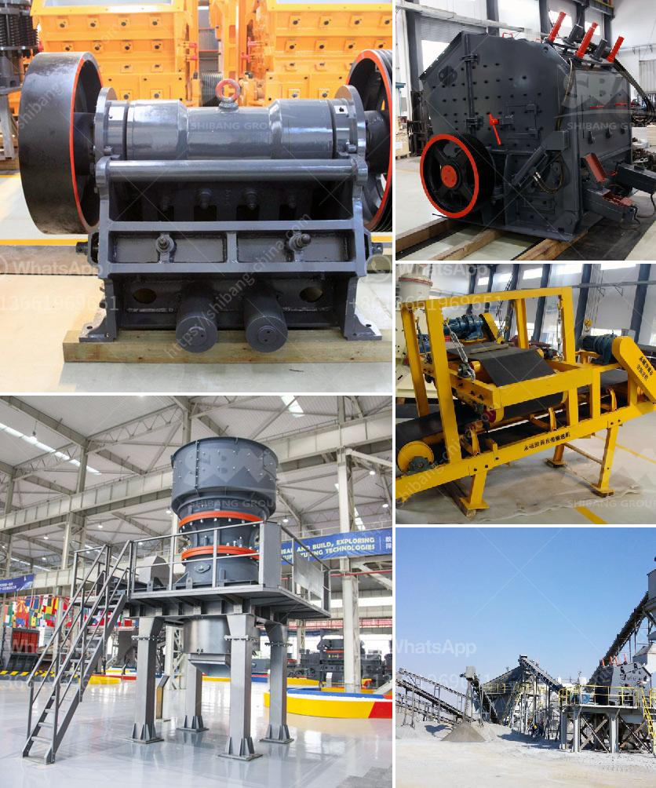

<h3>talc powder grinding mills in german</h3>
Talc, also known as talcum powder, is a naturally occurring mineral with a wide range of uses. The use of talc powder is becoming increasingly popular in various industries due to its excellent properties and versatility. German manufacturers are known for their excellent craftsmanship and precision engineering when it comes to manufacturing talc powder grinding mills.

Talc, a soft and smooth mineral, is mainly used in diverse industries such as cosmetics, ceramics, paint, paper, and plastics. It is an essential ingredient in many everyday products, including baby powder, body powder, and makeup products. Talc has various unique properties that make it highly valuable in these industries.

German manufacturers have a rich history in the mining and processing of talc. The best talc powder grinding mill manufacturers can provide the highest quality products, which can make you feel confident in your purchase.

In recent years, due to the continuous improvement of grinding technology, talc powder grinding mills have made great progress in terms of efficiency, powder fineness, energy consumption, and environmental protection. German manufacturers, with their advanced technology and expertise, have been at the forefront of these developments.

1. High Efficiency: German manufacturers use advanced grinding technology and innovative designs to create highly efficient talc powder grinding mills. These mills can grind talc powder to a fine and uniform particle size, ensuring maximum efficiency in various applications.

2. Improved Powder Fineness: With German-made grinding mills, the particle size of the talc powder can be adjusted to meet specific requirements. This enhanced powder fineness provides better performance and quality in the end products.

3. Reduced Energy Consumption: German manufacturers focus on energy-efficient designs and technologies, ensuring that their talc powder grinding mills require less energy to operate. This not only saves costs but also reduces environmental impact.

4. Environmentally Friendly: German manufacturers adhere to strict environmental regulations and standards during the manufacturing process. They use sustainable and eco-friendly practices, ensuring that the production of talc powder grinding mills has minimal impact on the environment.

5. Superior Quality: German manufacturers are known for their commitment to delivering high-quality products. Talc powder grinding mills manufactured in Germany are reliable and durable, ensuring a longer service life and excellent performance.

Talc powder grinding mills play a vital role in various industries, serving as a key ingredient in numerous consumer products. German manufacturers have proven their expertise and excellence in the manufacturing of talc powder grinding mills. Their focus on efficiency, powder fineness, energy consumption, and environmental protection sets them apart from their competitors. Investing in German-made grinding mills guarantees high-quality products that meet specific requirements, while also contributing to a more sustainable future.
<h3>Contact us</h3><ul><li><strong>Whatsapp:&nbsp;<a href="https://wa.me/8613661969651">+8613661969651</a></strong></li><li><a href="https://swt.shibang-china.com/?git&amp;zhl&amp;talc powder grinding mills in german"><strong>Online Service(chat now)</strong></a></li></ul><h3>Related</h3><ul><li><a href='vertical shaft impact crusher technical specifications.md'>vertical shaft impact crusher technical specifications</a></li><li><a href='mobile chrome wash plant for sale.md'>mobile chrome wash plant for sale</a></li><li><a href='limestone crusher cost.md'>limestone crusher cost</a></li><li><a href='simple formula for belt conveyor.md'>simple formula for belt conveyor</a></li><li><a href='rock quarry sizing process.md'>rock quarry sizing process</a></li></ul>