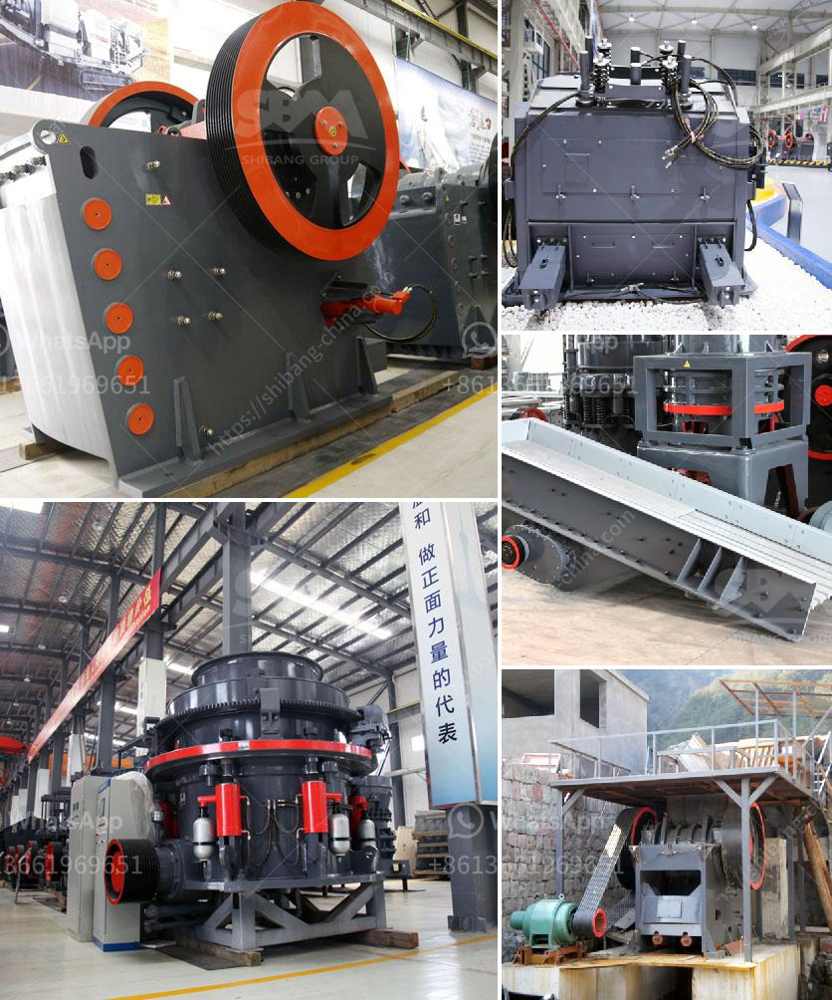

<h3>talc processing plant prices</h3>
Talc is a naturally occurring mineral that is widely used in various industries, including cosmetics, pharmaceuticals, ceramics, paint, paper, and more. Its softness, low friction, and high chemical resistance make it a valuable raw material for many applications. For this reason, the demand for talc continues to rise, leading to the establishment of talc processing plants to meet this demand.

The prices of talc processing plants can vary depending on various factors such as the location, capacity, and equipment used in the plant. Generally, larger plants with higher capacities are more expensive due to increased production capabilities. Additionally, the inclusion of advanced machinery and technology in the processing plant can also impact the prices.

The location of the plant plays a significant role in determining the prices. Talc deposits are found in different parts of the world, and setting up a processing plant near the source of the raw material reduces transportation costs, making the plant more cost-effective. On the other hand, it may be more expensive to establish a processing plant in regions where talc deposits are not abundant due to increased logistics costs.

Furthermore, the prices of talc processing plants can also be influenced by market dynamics. Fluctuations in the supply and demand for talc can impact the costs of establishing and operating these plants. If the demand for talc is high and the supply is limited, the prices of processing plants may increase due to market competition.

In conclusion, talc processing plant prices can vary depending on factors such as the location, capacity, and equipment used. The abundance of talc deposits in the vicinity, advanced machinery, and market dynamics also impact the overall cost. As the demand for talc continues to rise, the prices of processing plants are likely to reflect the growing demand and need for these valuable minerals.
<h3>Contact us</h3><ul><li><strong>Whatsapp:&nbsp;<a href="https://wa.me/8613661969651">+8613661969651</a></strong></li><li><a href="https://swt.shibang-china.com/?git&amp;zhl&amp;talc processing plant prices"><strong>Online Service(chat now)</strong></a></li></ul><h3>Related</h3><ul><li><a href='ball grinding mill india.md'>ball grinding mill india</a></li><li><a href='distribuidores de equipo de trituracion extec.md'>distribuidores de equipo de trituracion extec</a></li><li><a href='crusher plant price in ethiopia.md'>crusher plant price in ethiopia</a></li><li><a href='gold wash plant for sale canada.md'>gold wash plant for sale canada</a></li><li><a href='ball grinder machine.md'>ball grinder machine</a></li></ul>