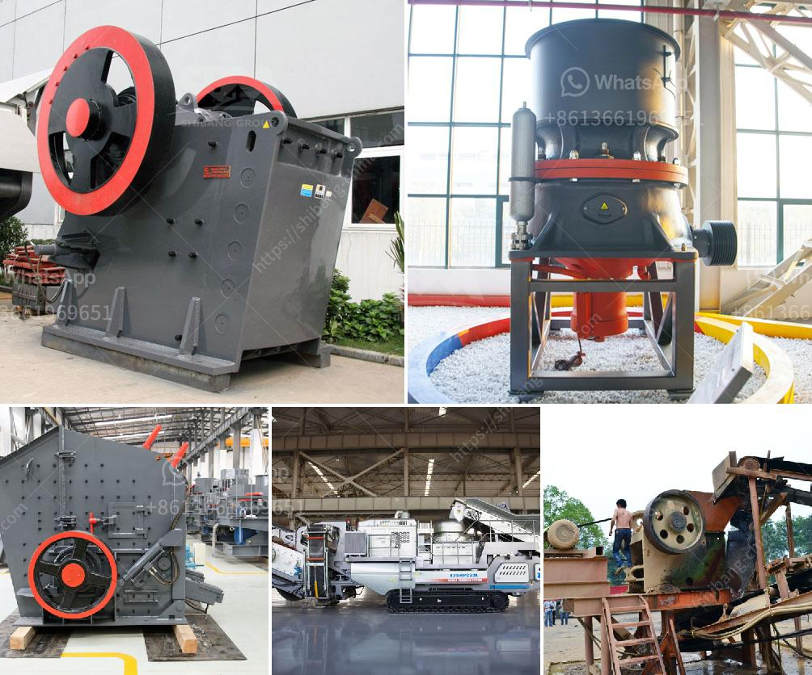

<h3>talc rock crusher</h3>
Talc is a metamorphic mineral resulting from the metamorphism of magnesium minerals such as serpentine, pyroxene, amphibole, and olivine. It is often found alongside other minerals such as chlorite, tremolite, and anthophyllite. Talc has a wide range of industrial applications due to its unique properties, including its softness, low abrasiveness, chemical inertness, and lamellar structure.

One of the most efficient tools for crushing talc rock is a talc rock crusher. This robust, versatile machine takes on heavy-duty crushing tasks with ease. Whether you’re crushing talc rock to extract talc powder for industrial applications or breaking it down for landscaping purposes, a talc rock crusher is an essential piece of equipment.

Talc rock crushers come in various types and sizes, but the basic principle of their operation remains the same. The machine crushes talc rocks into smaller pieces for subsequent processing. Particles are fed into the crusher’s hopper, where they are struck by rotating hammers that crush them against a rotating plate or anvils. The crushed particles then pass through a screen and are discharged from the machine.

One of the key advantages of using a talc rock crusher is its ability to produce consistent, uniform particle size distributions. This is particularly important for industries that require talc powder of specific grades and sizes. Crushing talc rock to achieve the desired particle size distribution can be challenging, but a well-designed crusher ensures a reliable and efficient process.

Additionally, talc rock crushers are built to withstand heavy-duty applications, making them suitable for crushing larger volumes of rocks. Their robust construction ensures longevity and reduces the risk of breakdowns, thereby maximizing productivity and minimizing downtime. Regular maintenance and proper operation of the crusher also contribute to its longevity and performance.

The versatility of talc rock crushers allows them to be used in various industries. In the plastics industry, talc powder acts as a filler, enhancing the product’s stiffness, impact resistance, and thermal conductivity. Pharmaceutical and cosmetics industries use talc powder due to its lubricating and anti-sticking properties. Talc rock crushers make it possible to transform talc rocks into useful materials for these industries, among others.

Some talc rock crushers are also equipped with additional features that enhance their functionality. These may include adjustable discharge settings to control the particle size distribution, automatic lubrication systems for hassle-free maintenance, and safety features to protect against accidents.

It is worth noting that environmental considerations are an important aspect of using talc rock crushers. Dust emissions can be a concern in crushing operations, but efficient dust control measures, such as the use of dust collectors and proper ventilation, can mitigate this issue.

In conclusion, talc rock crushers are indispensable tools for crushing talc rocks efficiently and effectively. They enable the transformation of talc rock into various grades of talc powder, suitable for use in different industries. Their robust construction, versatility, and ability to produce consistent particle size distributions make them valuable assets for businesses that rely on talc powder. Furthermore, proper maintenance and operation of these machines ensure their longevity and consistent performance.
<h3>Contact us</h3><ul><li><strong>Whatsapp:&nbsp;<a href="https://wa.me/8613661969651">+8613661969651</a></strong></li><li><a href="https://swt.shibang-china.com/?git&amp;zhl&amp;talc rock crusher"><strong>Online Service(chat now)</strong></a></li></ul><h3>Related</h3><ul><li><a href='nigeria stone crusher.md'>nigeria stone crusher</a></li><li><a href='hammer vibrating screens usa.md'>hammer vibrating screens usa</a></li><li><a href='kaolin processing plant machinery.md'>kaolin processing plant machinery</a></li><li><a href='iron ore beneficiation plant for sale.md'>iron ore beneficiation plant for sale</a></li><li><a href='mobile chrushers south africa.md'>mobile chrushers south africa</a></li></ul>