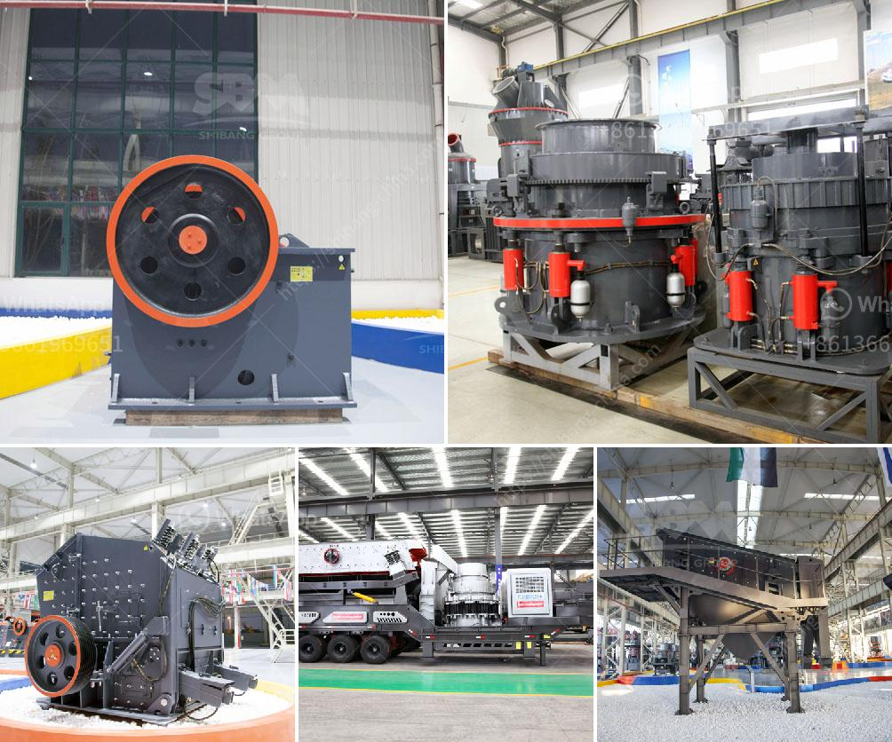

<h3>tata stone crusher machines</h3>
Stone crushing industry is an important industrial sector in the country. The crushed stone is used as a raw material for various construction activities such as building, bridges, highways, etc. One of the biggest challenges faced by the industry is inadequate supply of raw materials, mainly stones, to meet the demand for various construction projects. This is where the Tata Stone Crusher Machines come into picture.

Tata Hitachi Machinery Company, a subsidiary of Tata Motors, has been providing robust and reliable stone crushing machinery for over three decades. The company has been manufacturing various types of machines that not only cater to the diverse needs of the construction industry but also ensure maximum efficiency and productivity.

One of the key products manufactured by Tata Hitachi Machinery is a stone crusher machine. Let us understand the machine in detail. The stone crusher machine is divided into two main categories, which are cone crusher and jaw crusher. Both of these machines are used to crush large-sized rocks into smaller pieces, which then can be used for various construction purposes.

The cone crusher machine is known for its high crushing ratio, fine grain shape, and long service life. It can be used to crush rocks of medium-hardness, such as granite, limestone, basalt, etc. The machine is equipped with a hydraulic system that allows for easy and quick adjustment of the discharge opening, ensuring an optimal feeding size for efficient crushing.

On the other hand, the jaw crusher machine is designed for coarse crushing of large-sized rocks. It is suitable for crushing rocks of various hardness levels, ranging from soft materials like limestone to hard materials like granite. The machine is equipped with a motor-driven belt and pulley system that allows for smooth and efficient operation. The jaw crusher also has a simple structure, easy maintenance, and low operating costs.

Tata stone crusher machines are manufactured using high-quality materials, ensuring their durability and reliability. The company also provides excellent after-sales service to ensure maximum customer satisfaction. Moreover, Tata Hitachi Machinery is committed to sustainable development and thus adopts environmentally friendly practices in its manufacturing processes.

In conclusion, Tata stone crusher machines are a reliable and efficient solution for crushing stones for construction purposes. The machines are designed to perform in demanding conditions and ensure maximum productivity. With their robust construction, high-quality materials, and excellent after-sales service, Tata Hitachi Machinery has established itself as a reputable manufacturer in the stone crushing industry. So, if you are in need of stone crushing machinery, consider Tata stone crusher machines for a reliable and efficient solution.
<h3>Contact us</h3><ul><li><strong>Whatsapp:&nbsp;<a href="https://wa.me/8613661969651">+8613661969651</a></strong></li><li><a href="https://swt.shibang-china.com/?git&amp;zhl&amp;tata stone crusher machines"><strong>Online Service(chat now)</strong></a></li></ul><h3>Related</h3><ul><li><a href='second hand concrete grinding machine supplier in dubai.md'>second hand concrete grinding machine supplier in dubai</a></li><li><a href='mineral ball mill.md'>mineral ball mill</a></li><li><a href='rent a rock crusher saudi.md'>rent a rock crusher saudi</a></li><li><a href='mining and quarrying crusher machinery and equipment.md'>mining and quarrying crusher machinery and equipment</a></li><li><a href='crusher santa marta malaysia.md'>crusher santa marta malaysia</a></li></ul>