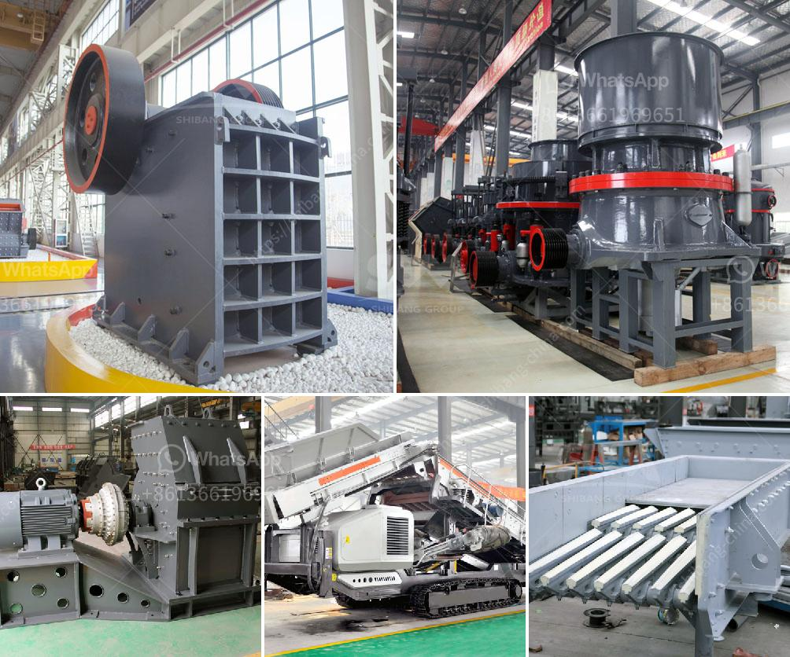

<h3>technical data sheet of stone crusher</h3>
Stone crusher is a machine designed to reduce large rocks into smaller rocks, gravel, or rock dust. Stone crushers may be used to reduce the size, or change the form, of waste materials so they can be more easily disposed of or recycled, or to reduce the size of a solid mix of raw materials, so that pieces of different composition can be differentiated.

A technical data sheet is a document that provides key information about a product, machine, or process. In this case, the technical data sheet is for the stone crusher machine, which is widely used in mining, construction, and other industries.

Stone crusher machine can be used for primary, secondary, and fine crushing to meet different crushing stages. We have stationary stone crusher machine and mobile stone crusher machine type for choice. We have stone crushers in stock and product delivery within 1-4 weeks.

The stone crusher machine utilizes a motor powered by an electric current. In turn, the motor drives the belt and pulley to make the movable jaw move back and forth along the eccentric shaft. When the movable jaw moves forward, the materials are crushed, impacted, and ground inside the crushing chamber. The crushed materials become smaller as they move down the crushing chamber until they are discharged through the bottom.

- Model: Our stone crusher machine is available in different models to meet various crushing requirements.

- Capacity: The capacity of our stone crusher machine ranges from 50tph to 1000tph, depending on the model.

- Feeding Size: The feeding size of the stone crusher machine varies from 150mm to 700mm, depending on the model.

- Output Size: The output size of the stone crusher machine can be adjusted to meet different customer requirements.

- Motor Power: Our stone crusher machines are available with motor power ranging from 5.5kw to 315kw.

Stone crusher machines are widely used for crushing various materials in mining, construction, water conservancy, metallurgy, and other industries. Some common materials that can be crushed include quartz, limestone, granite, basalt, river pebbles, marble, talc, and more.

The technical data sheet of the stone crusher machine provides detailed information about its various features, specifications, and applications. It highlights the benefits and advantages of the machine, and helps customers understand its functioning. By providing this technical data sheet, customers can make informed decisions about the suitability of the stone crusher machine for their specific needs.
<h3>Contact us</h3><ul><li><strong>Whatsapp:&nbsp;<a href="https://wa.me/8613661969651">+8613661969651</a></strong></li><li><a href="https://swt.shibang-china.com/?git&amp;zhl&amp;technical data sheet of stone crusher"><strong>Online Service(chat now)</strong></a></li></ul><h3>Related</h3><ul><li><a href='stone crusher dubai.md'>stone crusher dubai</a></li><li><a href='mobile rock crusher rental in malaysia.md'>mobile rock crusher rental in malaysia</a></li><li><a href='gravel gravel and sand mining equipment.md'>gravel gravel and sand mining equipment</a></li><li><a href='gold crusher for sale in turkey.md'>gold crusher for sale in turkey</a></li><li><a href='small scale pulverizing ball mill.md'>small scale pulverizing ball mill</a></li></ul>