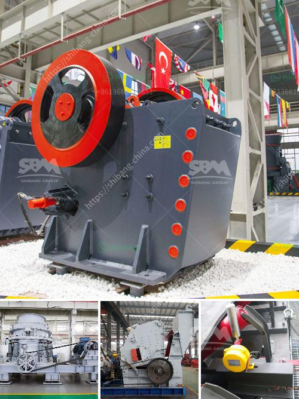

<h3>terrex stone crushers in usa</h3>
Terex Corporation is a leading manufacturer of heavy-duty construction and mining equipment. The company has been a pioneer in the industry since its establishment in 1933. One of the key offerings from Terex Corporation is its range of Terex stone crushers, which are immensely popular among customers in the United States.

Terex stone crushers are specifically designed to meet the needs of the construction and mining industry in the United States. These crushers are versatile, rugged, and can handle different types of materials, including reinforced concrete and asphalt. They are designed to work with a range of materials and deliver consistent, reliable performance.

One of the key features of Terex stone crushers is their ease of use and maintenance. These crushers are equipped with advanced technology and innovative features that make them easy to operate and maintain. This ensures that customers can achieve maximum productivity and efficiency with minimum downtime.

Terex stone crushers are also known for their durability and reliability. They are built to withstand the rugged conditions of the construction and mining industry. These crushers are made from high-quality materials and manufactured to the highest standards. This ensures that they can withstand heavy wear and tear and deliver long-lasting performance even in the toughest environments.

In addition to their durability, Terex stone crushers are also known for their high performance. These crushers are equipped with powerful engines that provide high crushing force and exceptional throughput. This enables them to process large quantities of material quickly and efficiently, thereby maximizing productivity on job sites.

Moreover, Terex stone crushers are designed to be energy-efficient. The company understands the importance of minimizing the environmental impact of its products. As a result, these crushers are designed to consume less fuel and produce fewer emissions, making them a sustainable choice for customers in the United States.

Terex Corporation also offers comprehensive aftermarket support for its stone crushers in the United States. The company has an extensive network of authorized dealers and service centers across the country, ensuring that customers can easily access spare parts and professional maintenance and repair services wherever they are located.

In conclusion, Terex stone crushers are a preferred choice of customers in the United States for their exceptional performance, durability, and ease of use. These crushers are designed to handle a wide range of materials and deliver consistent, reliable performance. They are also energy-efficient and built to withstand rugged conditions. With comprehensive aftermarket support, Terex Corporation ensures that customers can maximize the value of their investment in these crushers.
<h3>Contact us</h3><ul><li><strong>Whatsapp:&nbsp;<a href="https://wa.me/8613661969651">+8613661969651</a></strong></li><li><a href="https://swt.shibang-china.com/?git&amp;zhl&amp;terrex stone crushers in usa"><strong>Online Service(chat now)</strong></a></li></ul><h3>Related</h3><ul><li><a href='marble granite stone grinding machine price.md'>marble granite stone grinding machine price</a></li><li><a href='coal washing plant suppliers.md'>coal washing plant suppliers</a></li><li><a href='kaolin industry machine dhaka bangladesh.md'>kaolin industry machine dhaka bangladesh</a></li><li><a href='brand of conveyor belts.md'>brand of conveyor belts</a></li><li><a href='crusher manufacturers in india.md'>crusher manufacturers in india</a></li></ul>