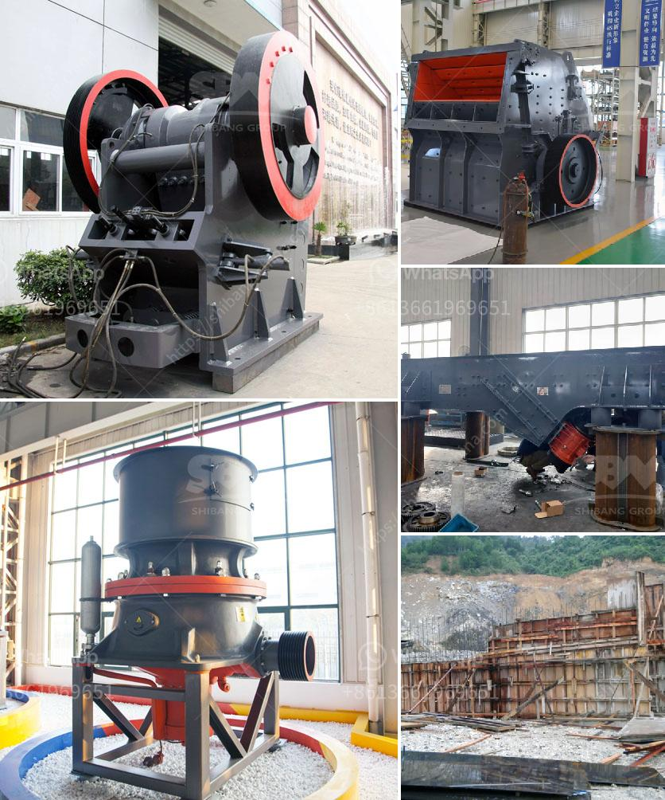

<h3>thailand for stone crusher plant</h3>
Thailand, officially known as the Kingdom of Thailand, is a Southeast Asian country located in the central part of the Indochinese Peninsula. It is bordered by Myanmar (Burma) to the northwest, Laos to the northeast, Cambodia to the southeast, and Malaysia to the south. With a rich cultural heritage and a tropical climate, Thailand is a popular tourist destination for people from all over the world. Besides its beautiful landscapes and vibrant cities, Thailand is also known for its thriving industrial sector and vast mineral resources. One such resource is limestone, which is mined from vast quarries and then processed into various products like cement, crushed stone, and lime. 

Stone crushing plant is a specialized production line aimed to produce building sand and stone, saving 50% energy than traditional stone production line. It enables the rock, sand and gravel, cobble and other materials to be made into various granularities conformed to the requirements of building sand. With reasonable design the significant breakthroughs made in the scientific and technological innovation, and the upgrading of industrial structures, stone crusher plant systems have expanded from coarse processing to medium fine-crushing, and the total amount of mechanized crushing and screening plants is increasing day by day. 

Thailand's mineral reserves are diverse and extensive, which include industrial minerals such as gypsum, limestone, dolomite, mica, rock salt, potash, and many others. Limestone is an important raw material for the construction industry as it is the key ingredient in the production of cement. To meet the growing demands of the construction industry, Thailand has witnessed a significant expansion in the limestone mining sector. Stone crusher plants are increasingly being used to process materials such as rocks and ores into aggregates for construction, offering an efficient and low-cost crushing solution for contractors.

The jaw crusher is the primary crushing machine used in the stone crushing plant. It is large-scale and high-output. It is especially suitable for processing large stones into sand for building and construction purposes. Impact crusher is a commonly used secondary crushing machine that has a large sum of rocks processed into qualified granules by the production line, and then the crushed materials are conveyed to the sand making machine and screened by the vibrating screen. 

Thailand's stone crushing industry is growing and becoming more vibrant each year. The investment in new stone crushing plants and expansion of existing crushers can be seen as a strategic move to ensure the country's stone crushing production capacity is confirmed to meet the country's increasing construction demands. Moreover, the stone crusher plants are also increasingly being stationed in remote locations to cater to the growing demands in those areas.

In conclusion, Thailand is a country that offers a favorable business environment for stone crusher plants. With its rich resources and diverse industrial sector, Thailand is a great place for any entrepreneur looking to invest in a stone crushing plant. So, if you are considering starting a stone crusher plant, Thailand is an ideal location for your needs. With its booming construction industry and vast mineral resources, you can confidently invest and operate your stone crushing business in this beautiful country.
<h3>Contact us</h3><ul><li><strong>Whatsapp:&nbsp;<a href="https://wa.me/8613661969651">+8613661969651</a></strong></li><li><a href="https://swt.shibang-china.com/?git&amp;zhl&amp;thailand for stone crusher plant"><strong>Online Service(chat now)</strong></a></li></ul><h3>Related</h3><ul><li><a href='quarrying crusher machines south africa.md'>quarrying crusher machines south africa</a></li><li><a href='cement factory equipment list.md'>cement factory equipment list</a></li><li><a href='bentonite clay processing production line supplier.md'>bentonite clay processing production line supplier</a></li><li><a href='price of stone crusher machine.md'>price of stone crusher machine</a></li><li><a href='used coal washing plants for sale in india.md'>used coal washing plants for sale in india</a></li></ul>