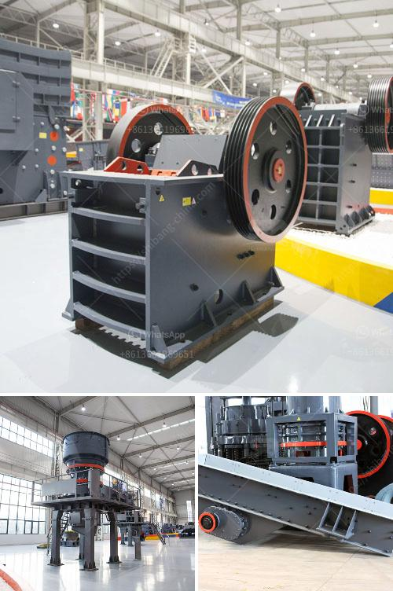

<h3>the cost of a clay brick making machine in south africa</h3>
The cost of a clay brick making machine in South Africa is a crucial aspect that one should prioritise when investing in this promising market. However, with the influx of machinery suppliers, choosing a quality machine at an affordable price can be challenging.

When considering the cost of a brick making machine, several factors come into play. Firstly, the production capacity of the machine is an important consideration. Depending on the specific needs and demands of your brick making business, you can choose a machine that produces a certain number of bricks per hour. Machines with higher production capacities generally cost more due to their increased efficiency and output.

Secondly, the technology and features incorporated within the machine influence its price. Advanced brick making machines may have additional features such as automatic operation, hydraulic systems, and interchangeable moulds, which enhance productivity and reduce manual labour. While these features can significantly drive up the cost, they also offer long-term benefits in terms of efficiency and reliability.

Moreover, the quality and durability of the clay brick making machine are vital factors to consider. Investing in a machine with low-quality materials and components may result in frequent breakdowns and repairs, leading to additional expenses. Therefore, it is advisable to choose a machine from a reputable supplier that ensures robust construction and uses high-grade materials, even if it means paying a slightly higher price initially.

It is important to recognize that the cost of a clay brick making machine also varies depending on the location and availability of raw materials. South Africa, fortunately, has abundant clay deposits, which lowers the cost of production. Consequently, the cost of a clay brick making machine is relatively lower compared to regions with limited access to clay deposits.

Considering the above factors, the average cost of a clay brick making machine in South Africa can range from around R20,000 to R1,50,000. This cost includes the machine itself, transportation, and installation. However, it is essential to request detailed quotations and specifications from different suppliers to obtain an accurate estimate of the total cost.

When comparing prices, it is crucial to take into account after-sales services provided by the supplier. Trustworthy suppliers offer warranty periods, technical support, and spare parts availability. These services ensure a seamless operation and minimize downtime significantly in the event of any issues with the machine.

To conclude, the cost of a clay brick making machine in South Africa depends on multiple factors, including production capacity, technology, machine quality, availability of raw materials, and after-sales services. It is advisable to explore different suppliers and obtain detailed quotations to make an informed decision. Ultimately, investing in a high-quality, efficient, and durable machine may require a higher upfront cost, but it ensures long-term profitability and success in the brick making business.
<h3>Contact us</h3><ul><li><strong>Whatsapp:&nbsp;<a href="https://wa.me/8613661969651">+8613661969651</a></strong></li><li><a href="https://swt.shibang-china.com/?git&amp;zhl&amp;the cost of a clay brick making machine in south africa"><strong>Online Service(chat now)</strong></a></li></ul><h3>Related</h3><ul><li><a href='mining equipment manufacturers colombia.md'>mining equipment manufacturers colombia</a></li><li><a href='granite and marble mining in uganda.md'>granite and marble mining in uganda</a></li><li><a href='delhi ball mill ceramic lining.md'>delhi ball mill ceramic lining</a></li><li><a href='technical data sheet of stone crusher.md'>technical data sheet of stone crusher</a></li><li><a href='milling machine grinding mill.md'>milling machine grinding mill</a></li></ul>