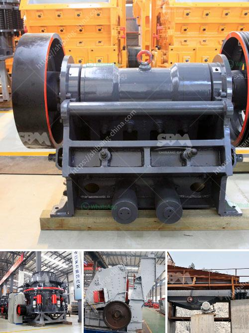

<h3>the production process of cobblestone</h3>
Cobblestone production is a fascinating and intricate process that involves several stages to transform raw materials into the charming and durable stones that we see in outdoor hardscaping projects. This article will take you through the different steps involved in the production of cobblestones.

The first step in cobblestone production is selecting the raw materials. Traditionally, cobblestones were made from naturally occurring stones, usually granite or basalt, due to their durability and strength. Today, you may also find cobblestones made from concrete or reclaimed materials.

Once the raw materials are obtained, they are carefully sorted and graded for quality. Stones with irregular shapes and sizes are preferred, as they will give the final product a rustic and timeless look. The selected stones are then cleaned to remove any dirt, debris, or impurities.

Next, the stones are shaped or cut to achieve a more uniform size. This can be done through a variety of methods, such as hand cutting, sawing, or using machines specifically designed for cobblestone production.

After shaping, the stones undergo a process called surface treatment to enhance their appearance and durability. This may involve tumbling the stones in a rotating drum with water and abrasive materials to smooth out any rough edges and give them a weathered look. Some cobblestones are also subjected to flame treatment to create a unique texture and finish.

Once the surface treatment is complete, the cobblestones are thoroughly inspected for quality control. Stones with cracks, chips, or other defects are discarded, ensuring only the finest pieces move forward.

Finally, the finished cobblestones are prepared for shipment or installation. They are carefully packed to avoid any damage during transportation and stored in a secure manner.

The production process of cobblestones requires attention to detail, craftsmanship, and a deep understanding of the materials involved. From selecting the raw materials to the final quality control, every stage is crucial in creating beautiful and long-lasting cobblestones that enhance the aesthetics and functionality of outdoor spaces.
<h3>Contact us</h3><ul><li><strong>Whatsapp:&nbsp;<a href="https://wa.me/8613661969651">+8613661969651</a></strong></li><li><a href="https://swt.shibang-china.com/?git&amp;zhl&amp;the production process of cobblestone"><strong>Online Service(chat now)</strong></a></li></ul><h3>Related</h3><ul><li><a href='types coal ball mill.md'>types coal ball mill</a></li><li><a href='gypsum board making machine price in india.md'>gypsum board making machine price in india</a></li><li><a href='brand of conveyor belts.md'>brand of conveyor belts</a></li><li><a href='manufacturer of ball mill companies indonesia.md'>manufacturer of ball mill companies indonesia</a></li><li><a href='the cost of a clay brick making machine in south africa.md'>the cost of a clay brick making machine in south africa</a></li></ul>