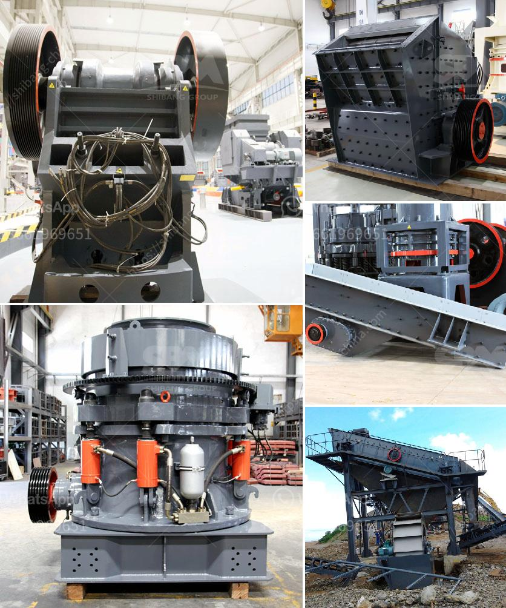

<h3>three roller mill pakistan</h3>
The three roller mill is a vital piece of machinery used in the industrial sector for the milling of various materials. This equipment is highly efficient, allowing for the extraction of valuable substances from raw materials. In Pakistan, the three roller mill has gained significant popularity due to its numerous benefits and versatility.

One of the key advantages of the three roller mill is its ability to finely grind different materials. It is equipped with three rollers that rotate in opposite directions, crushing and grinding the substances between them. This process results in a uniform and fine powder, making it ideal for various industries such as food, pharmaceuticals, and cosmetics. Additionally, the three roller mill has the capability to process both dry and wet materials, enhancing its versatility.

Another significant advantage of the three roller mill is its high throughput capacity. With its efficient design, this mill can handle large quantities of material, making it suitable for commercial and industrial production. In Pakistan, where industries are thriving and demand is high, the three roller mill allows businesses to meet market demands effectively. Moreover, the machine's durability and low maintenance requirements ensure its longevity, resulting in cost-effective operations for businesses.

Furthermore, the three roller mill offers exceptional control over the final product. The adjustable gap between the rollers enables precise customization of the particle size and texture of the milled materials. This level of control is particularly crucial in industries such as paint manufacturing, where specific particle sizes are required for optimal performance. Pakistani industries can benefit greatly from this feature, ensuring high-quality output and customer satisfaction.

In conclusion, the three roller mill is an invaluable piece of equipment in Pakistan's industrial landscape. Its ability to finely grind, high throughput capacity, and precise control over the final product make it a preferred choice for numerous industries. As the manufacturing sector continues to grow in Pakistan, the three roller mill will undoubtedly play a prominent role in meeting the diverse needs of businesses and consumers alike.
<h3>Contact us</h3><ul><li><strong>Whatsapp:&nbsp;<a href="https://wa.me/8613661969651">+8613661969651</a></strong></li><li><a href="https://swt.shibang-china.com/?git&amp;zhl&amp;three roller mill pakistan"><strong>Online Service(chat now)</strong></a></li></ul><h3>Related</h3><ul><li><a href='buy crusher of jaw.md'>buy crusher of jaw</a></li><li><a href='dolomite ball mill price.md'>dolomite ball mill price</a></li><li><a href='barite beneficiation.md'>barite beneficiation</a></li><li><a href='india crushers association.md'>india crushers association</a></li><li><a href='manufacture of ball mill stator.md'>manufacture of ball mill stator</a></li></ul>