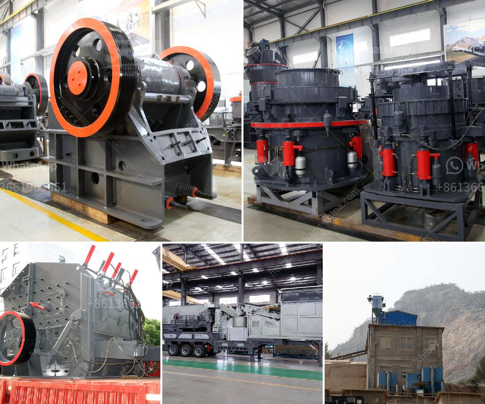

<h3>ton day cement clinker grinding plant</h3>
Title: Transforming the Construction Industry with Environmentally Friendly Cement Clinker Grinding Plants

In the modern era of sustainable development and environmental consciousness, industries around the world are increasingly shifting towards greener alternatives. The construction sector, in particular, holds immense potential to reduce its carbon footprint. One significant breakthrough in this realm is the advent of cement clinker grinding plants. This article explores the emergence of these environmentally friendly facilities and their transformative impact on the construction industry.

Cement production is a resource-intensive process that results in significant carbon emissions. However, the introduction of cement clinker grinding plants has revolutionized the traditional cement manufacturing process. These specialized facilities aim to reduce carbon emissions while preserving the quality and durability of the final product.

Cement clinker grinding plants primarily focus on the production of clinker, a crucial raw material used in the manufacturing of cement. By grinding clinker, these plants aim to increase the surface area, creating better bonding characteristics between cement and aggregates. Additionally, grinding clinker improves the reactivity and strength properties of cement, leading to longer-lasting and more resilient concrete structures.

One of the most compelling aspects of cement clinker grinding plants lies in their positive impact on the environment. These plants employ innovative technologies that significantly reduce greenhouse gas emissions and energy consumption. By adopting advanced grinding methods and utilizing renewable energy sources, such as solar power or wind energy, these plants minimize the production of harmful pollutants typically associated with traditional cement manufacturing.

Moreover, cement clinker grinding plants promote the use of alternative fuels. Traditional cement manufacturing processes heavily rely on fossil fuels, which contribute to carbon emissions. However, by substituting waste materials, biomass, or even agricultural residues, these plants minimize the environmental impact while maintaining their operational efficiency.

Beyond the environmental benefits, cement clinker grinding plants also offer immense economic and social advantages. The establishment of these facilities creates employment opportunities, boosting local economies and supporting regional development. Moreover, the adoption of sustainable cement production methods enhances the reputation of construction companies, making them attractive to environmentally conscious customers and investors.

Furthermore, the production of superior-quality cement through clinker grinding plants results in more durable and resilient structures. This not only reduces long-term maintenance costs but also enhances the safety and reliability of construction projects. By prioritizing sustainable practices, the construction industry can build a greener and safer future for urban landscapes.

The emergence of cement clinker grinding plants represents a pivotal turning point in the construction industry's journey towards sustainability. These facilities prioritize environmental consciousness, economic viability, and social responsibility, revolutionizing cement production methods. By minimizing greenhouse gas emissions, employing renewable energy sources, and adopting alternative fuels, cement clinker grinding plants aim to create a more sustainable and resilient future for the construction sector. As construction companies and policymakers increasingly embrace these green alternatives, the world witnesses a significant transformation in how buildings and infrastructure are constructed, ensuring a greener and safer planet for generations to come.
<h3>Contact us</h3><ul><li><strong>Whatsapp:&nbsp;<a href="https://wa.me/8613661969651">+8613661969651</a></strong></li><li><a href="https://swt.shibang-china.com/?git&amp;zhl&amp;ton day cement clinker grinding plant"><strong>Online Service(chat now)</strong></a></li></ul><h3>Related</h3><ul><li><a href='horizontal grinding mills price.md'>horizontal grinding mills price</a></li><li><a href='coal crusher 350tph.md'>coal crusher 350tph</a></li><li><a href='granite and marble business plan pdf.md'>granite and marble business plan pdf</a></li><li><a href='crushing stones for gold.md'>crushing stones for gold</a></li><li><a href='small scale gold mining equipment in ghana price.md'>small scale gold mining equipment in ghana price</a></li></ul>