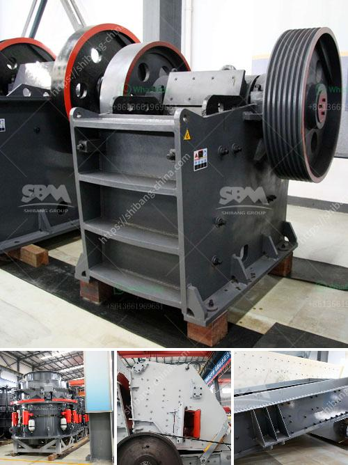

<h3>ton gold wash plant for sale</h3>
In the realm of mining, nothing epitomizes success quite like gold. This coveted precious metal has fascinated civilizations for centuries, and its allure as a potent symbol of wealth and prosperity continues to this day. For those seeking to embark on a venture steeped in potential fortunes, a 10-ton gold wash plant for sale presents an irresistible opportunity. With its cutting-edge technology and remarkable capacity, this innovative equipment promises to revolutionize your gold mining ambitions.

One of the key advantages of a 10-ton gold wash plant is its remarkable efficiency. This high-performing heavy machinery enables miners to streamline their operations and extract more gold in less time. Equipped with advanced water jets and high-pressure hoses, the wash plant efficiently separates soil, rocks, and debris from valuable gold-bearing material. With this automated system, the process is incredibly efficient, reducing human effort, and maximizing productivity.

The large-scale nature of a 10-ton gold wash plant ensures an abundant capacity for gold extraction. Built to handle substantial quantities of material, this equipment eliminates the time-consuming need for repetitive batch processes. Through its advanced machinery and robust design, the wash plant can process large volumes of pay dirt, providing ample opportunity to uncover substantial gold deposits. This means a greater potential for profit and a faster return on investment.

To cater to the unique requirements of every mining operation, a 10-ton gold wash plant for sale offers significant customization options. Whether you are working in a remote location or a highly regulated mining environment, these wash plants can be tailored to meet your specific needs. They can be easily integrated with other machinery, such as conveyors or excavators, to form a seamless mining system. Furthermore, they can be customized to incorporate special features for different types of soil or geographical conditions. Such adaptability allows miners to maximize their chances of success in any given setting.

A modern 10-ton gold wash plant for sale showcases the latest advancements in gold mining technology. These sophisticated machines are equipped with state-of-the-art sensors, processors, and software. This technological prowess ensures accurate gold recovery rates, minimizing losses and maximizing profits. With built-in monitoring systems and automated control panels, operators can easily calibrate and adjust the wash plant's settings for optimal performance.

In the ambitious world of gold mining, investing in a 10-ton gold wash plant for sale is a game-changer. With its exceptional efficiency, ample capacity, customization options, and cutting-edge technology, this equipment holds the potential to unearth vast fortunes. The combination of advanced machinery and innovative design provides miners with the competitive edge needed to extract substantial amounts of gold swiftly and profitably. So, if you aspire to strike gold and realize your entrepreneurial ambitions, a 10-ton gold wash plant is undoubtedly an investment worth considering – one that may pave the way to a prosperous future.
<h3>Contact us</h3><ul><li><strong>Whatsapp:&nbsp;<a href="https://wa.me/8613661969651">+8613661969651</a></strong></li><li><a href="https://swt.shibang-china.com/?git&amp;zhl&amp;ton gold wash plant for sale"><strong>Online Service(chat now)</strong></a></li></ul><h3>Related</h3><ul><li><a href='limestone crusher cost.md'>limestone crusher cost</a></li><li><a href='jaw crusher supplier.md'>jaw crusher supplier</a></li><li><a href='jaw crushers price.md'>jaw crushers price</a></li><li><a href='stone crushing plant for sale in south africa.md'>stone crushing plant for sale in south africa</a></li><li><a href='marble and granite plant.md'>marble and granite plant</a></li></ul>