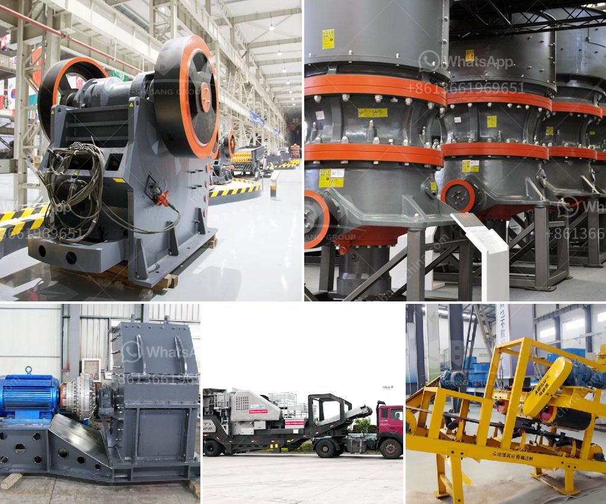

<h3>ton per jam jaw crusher</h3>
A jaw crusher is a machine that utilizes an electric excavator to crush rocks or ores in a rocky or gravel-like terrain. This equipment is mostly used for crushing rocks or ores that are not very hard, such as limestone, limestone, or dolomite. The jaw crusher has a range of uses and is highly valued in the mining and construction industries.

One specific type of jaw crusher that is widely used is the ton per jam jaw crusher. This machine is specifically designed to handle large rocks and ores and crush them into smaller sizes. The ton per jam jaw crusher is capable of processing between 300 to 500 tons of rock or ore per hour. This quarry machine provides a significant increase in productivity and efficiency for any mining or construction operation.

The ton per jam jaw crusher is equipped with a heavy-duty, high-quality jaw plate, which ensures that the machine can withstand heavy loads and maintain a long service life. It utilizes a hydraulic system to adjust the size of the output material, allowing for quick and easy changes to produce different sizes of crushed rock or ore.

The machine's design incorporates advanced technology to maximize its efficiency and productivity. It features a large feed opening, which allows for easy feeding of the material into the crusher. The ton per jam jaw crusher also has a deep crushing chamber, ensuring that there is sufficient space for the material to be properly crushed.

In terms of safety, the ton per jam jaw crusher is designed with the operator in mind. It has a user-friendly control panel that allows for easy operation of the machine. Additionally, it is equipped with safety features such as automatic overload protection, which prevents the crusher from being damaged due to excessive loads.

The ton per jam jaw crusher also offers significant cost savings for users. Its efficient design and high productivity mean that fewer machines are required for the same amount of work, resulting in reduced operational costs. Additionally, the machine's durability and long service life mean that maintenance and replacement costs are minimized.

Overall, the ton per jam jaw crusher is a highly efficient and productive machine that is perfect for crushing large rocks or ores. Its robust construction, advanced technology, and safety features make it a valuable asset for any mining or construction project. Whether it is used in a quarry, mine, or construction site, the ton per jam jaw crusher provides excellent performance and reliability.
<h3>Contact us</h3><ul><li><strong>Whatsapp:&nbsp;<a href="https://wa.me/8613661969651">+8613661969651</a></strong></li><li><a href="https://swt.shibang-china.com/?git&amp;zhl&amp;ton per jam jaw crusher"><strong>Online Service(chat now)</strong></a></li></ul><h3>Related</h3><ul><li><a href='slag crusher for sale.md'>slag crusher for sale</a></li><li><a href='south africa crusher sale.md'>south africa crusher sale</a></li><li><a href='machine to crush quartz into powder.md'>machine to crush quartz into powder</a></li><li><a href='limestone crushing plant sale in pakistan.md'>limestone crushing plant sale in pakistan</a></li><li><a href='how much mini cement plant cost in india.md'>how much mini cement plant cost in india</a></li></ul>