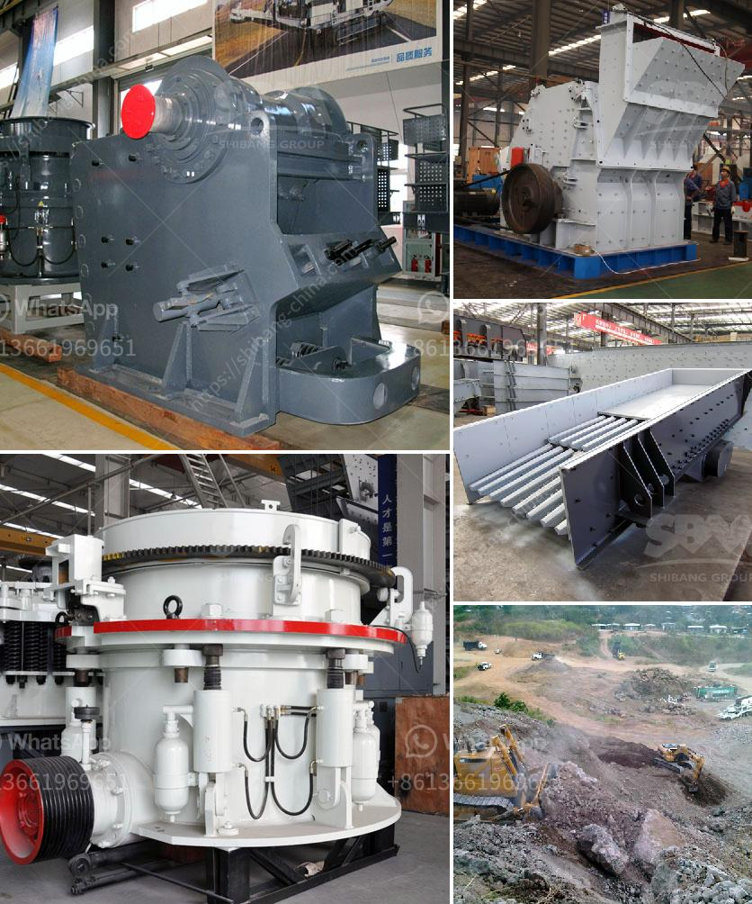

<h3>tonne an hour ball mill</h3>
A tonne an hour ball mill is a large mechanical device used to grind ore and other materials into tiny particles. This equipment is commonly used in the mining and mineral processing industries to grind materials, such as quartz, copper ore, gold ore, magnetite ore, limestone, and others. The grinding process inside the ball mill involves a combination of impact and attrition forces, resulting in the reduction of the ore to a fine powder.

The tonne an hour ball mill has a cylindrical shell that rotates around its axis. Inside the shell, there are steel balls that are used to grind the ore. As the shell rotates, the balls are lifted upwards and then dropped back onto the ore, causing it to be crushed and ground. The rotating motion of the mill provides efficient grinding, ensuring that the particles are finely ground to the desired size.

The tonne an hour ball mill is designed to handle large quantities of ore and has a high production capacity. With the ability to process up to one tonne of material per hour, this equipment is essential in high-volume mining operations. It allows for continuous grinding and is often used in concentration plants, where a constant supply of finely ground ore is required.

The tonne an hour ball mill is designed for durability and long-term operation. It is constructed with high-quality materials, such as hardened steel, to withstand the harsh working conditions in the mining industry. The internal components of the mill are also designed to be resistant to wear and abrasion, ensuring a longer lifespan and reduced maintenance requirements.

In conclusion, the tonne an hour ball mill is a crucial piece of equipment in the mining and mineral processing industries. It provides efficient grinding of ore, allowing for the extraction of valuable minerals. With its high production capacity and durability, this equipment is an essential tool for any mining operation.
<h3>Contact us</h3><ul><li><strong>Whatsapp:&nbsp;<a href="https://wa.me/8613661969651">+8613661969651</a></strong></li><li><a href="https://swt.shibang-china.com/?git&amp;zhl&amp;tonne an hour ball mill"><strong>Online Service(chat now)</strong></a></li></ul><h3>Related</h3><ul><li><a href='dry grinding ball mills for lime.md'>dry grinding ball mills for lime</a></li><li><a href='stone crushing machine prices za.md'>stone crushing machine prices za</a></li><li><a href='sand washing plants in india.md'>sand washing plants in india</a></li><li><a href='stone crusher 7 tonne per day.md'>stone crusher 7 tonne per day</a></li><li><a href='portable crusher in malaysia.md'>portable crusher in malaysia</a></li></ul>