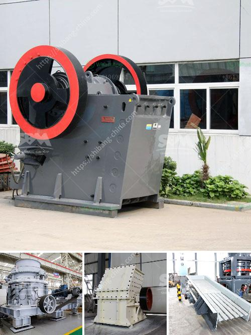

<h3>tonne stone crusher cost sale</h3>
In today's construction industry, saving cost without compromising efficiency is of utmost importance. With the growing demand for construction materials, the need for sustainable solutions has become imperative. One such solution that stands out in terms of efficiency and cost-effectiveness is the tonne stone crusher.

A tonne stone crusher, also known as a rock crusher, is a machine designed to crush large stones into smaller sizes. This machine plays a vital role in the construction industry as it provides crushed stones, which are used as raw materials for various projects, such as roads, bridges, buildings, and railways. The tonne stone crusher helps in reducing the waste generated from large-scale construction projects by converting the stone waste into usable materials.

One major advantage of using a tonne stone crusher is its cost-effectiveness. By crushing and reusing the waste stones, construction companies can save a significant amount of money that would otherwise be spent on buying new stones. Moreover, the production cost of crushed stones is comparatively lower than that of natural stones. This makes the tonne stone crusher a cost-effective solution for construction companies looking to minimize their expenses without compromising the quality of their projects.

Furthermore, the use of tonne stone crushers promotes natural resource conservation. By using recycled materials, the demand for natural stones can be reduced, leading to the conservation of natural resources, such as limestone, granite, and sandstone. This is essential for preserving the environment and ensuring sustainable development.

In conclusion, the tonne stone crusher is a valuable asset for the construction industry. Its cost-effectiveness and contribution to natural resource conservation make it an ideal choice for construction companies looking to save costs and reduce their environmental footprint. The use of the tonne stone crusher not only provides reusable materials but also encourages sustainable practices in the construction sector. By adopting such innovative solutions, we can promote a greener and more sustainable future for our planet.
<h3>Contact us</h3><ul><li><strong>Whatsapp:&nbsp;<a href="https://wa.me/8613661969651">+8613661969651</a></strong></li><li><a href="https://swt.shibang-china.com/?git&amp;zhl&amp;tonne stone crusher cost sale"><strong>Online Service(chat now)</strong></a></li></ul><h3>Related</h3><ul><li><a href='industrial uses of white marble powder.md'>industrial uses of white marble powder</a></li><li><a href='screw conveyor design calculation.md'>screw conveyor design calculation</a></li><li><a href='france roller mills.md'>france roller mills</a></li><li><a href='ballast crusher supplier.md'>ballast crusher supplier</a></li><li><a href='project report on stone crushing unit.md'>project report on stone crushing unit</a></li></ul>