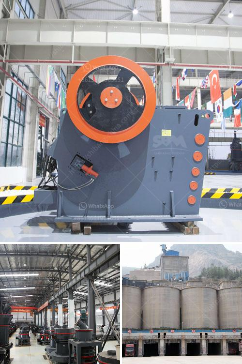

<h3>tonnes per hour crusher</h3>
In the mining and construction industry, countless tons of material are being transported and processed every hour, making efficiency and productivity paramount. One integral machine that plays a significant role in this process is the tonnes per hour crusher. With its ability to crush large quantities of materials efficiently and reliably, this machine has become an essential component of many operations.

Efficiency is a critical consideration for any crushing operation, and the tonnes per hour crusher is designed to address this requirement. With its powerful high-speed operation, it can process large quantities of material in a shorter timeframe, saving both time and resources. Whether it's rock, stone, or ore, the tonnes per hour crusher can handle it.

One of the key advantages of this crusher is its versatility. It can be used in various applications, including mining, aggregate production, and construction. The flexibility lies in its adjustable settings, allowing operators to customize the output size and optimize the crushing process for different materials. This adaptability ensures maximum productivity and minimal downtime.

Another noteworthy aspect of the tonnes per hour crusher is its robust construction. Built to withstand heavy-duty operations, it can tackle demanding materials without compromising performance. Additionally, advanced safety features are integrated to ensure a secure working environment.

With a range of sizes available, the tonnes per hour crusher can efficiently process different capacity requirements. From smaller quarries to large-scale mining operations, this crusher offers the capability to meet the diverse needs of any project.

Furthermore, the tonnes per hour crusher is engineered for easy maintenance and minimal downtime. Service and repair tasks are simplified, thanks to its user-friendly design, ensuring operators can swiftly address any issues that might arise.

In conclusion, the tonnes per hour crusher stands as a powerful solution for maximizing efficiency and productivity in the mining and construction industry. Its ability to handle large quantities of material, adaptability across different applications, and robust construction make it an indispensable piece of equipment. Furthermore, its user-friendly design and easy maintenance contribute to a seamless operation, ensuring minimal downtime. By investing in a tonnes per hour crusher, businesses can significantly enhance their material processing capabilities, ultimately driving overall profitability.
<h3>Contact us</h3><ul><li><strong>Whatsapp:&nbsp;<a href="https://wa.me/8613661969651">+8613661969651</a></strong></li><li><a href="https://swt.shibang-china.com/?git&amp;zhl&amp;tonnes per hour crusher"><strong>Online Service(chat now)</strong></a></li></ul><h3>Related</h3><ul><li><a href='iron ore processing pdf.md'>iron ore processing pdf</a></li><li><a href='concrete crusher hire nigeria.md'>concrete crusher hire nigeria</a></li><li><a href='jaw crusher what price in china.md'>jaw crusher what price in china</a></li><li><a href='difference between residual and transported soil.md'>difference between residual and transported soil</a></li><li><a href='vibrating grizzly feeder 35 ton per jam.md'>vibrating grizzly feeder 35 ton per jam</a></li></ul>