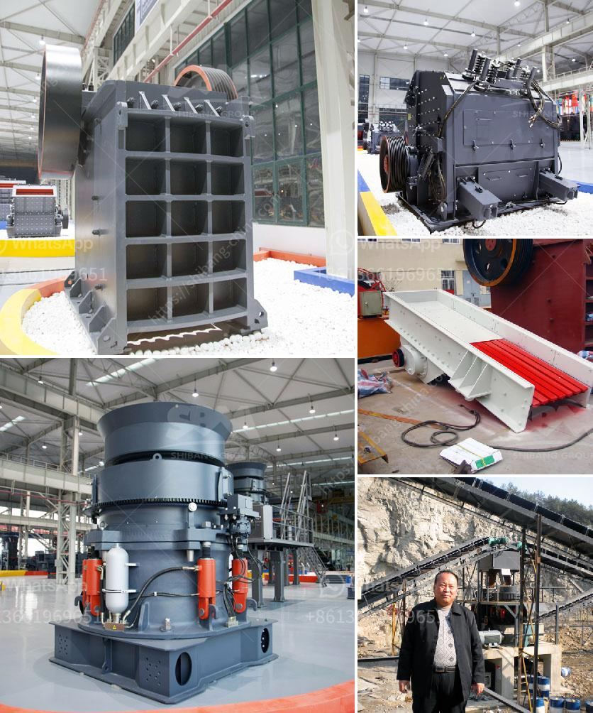

<h3>tons hour gold wash plant</h3>
Gold mining is an industry that has flourished for centuries, attracting miners with the promise of valuable ores and substantial profits. As technology advances, so do the tools and machinery used in gold mining operations. Among these innovative tools is the tons-hour gold wash plant - a powerful solution designed to efficiently process large quantities of gold-bearing material. In this article, we will explore the functionality, benefits, and potential outcomes of operating a tons-hour gold wash plant.

A tons-hour gold wash plant is specifically designed to process large volumes of gold-bearing material, typically found in riverbeds or alluvial deposits. The plant utilizes a rotating trommel screen, which acts as a filter, separating the dissolved gold particles from rocks, sand, and gravel. These dissimilar materials are then directed onto separate conveyor belts, ensuring optimized processing and minimal wastage.

1. Efficient Gold Recovery: The key advantage of a tons-hour gold wash plant is its ability to process massive volumes of material quickly and accurately. With high-capacity trommel screens, the plant can handle large amounts of material efficiently, effectively extracting gold particles and leaving behind only non-valuable debris.

2. Time and Cost Savings: Compared to manual mining methods, using a tons-hour gold wash plant significantly reduces labor costs, as the plant requires fewer people to operate. Moreover, it eliminates the need for extensive hand labor, saving time and resources.

3. Environmental Sustainability: One of the challenges in gold mining is minimizing its ecological impact. A tons-hour gold wash plant helps address this concern by minimizing soil disruption and reducing the need for chemical-based extraction processes. The plant's efficient gold recovery system ensures that more gold is captured, reducing the amount of tailings and waste generated.

1. Increased Output: With its ability to process large volumes of material, a tons-hour gold wash plant significantly increases the output of recovered gold compared to manual mining methods. This means higher profits for mining companies and increased economic benefits for local communities.

2. Strengthened Security: Gold wash plants can be equipped with security measures, such as surveillance cameras and fencing, to protect the valuable minerals from theft or unauthorized access. This added security strengthens the overall operational safety and reduces the potential for financial losses.

3. Versatile Applications: While a tons-hour gold wash plant is primarily used for gold mining, it can also be utilized for processing other valuable minerals, such as diamonds and gemstones. This versatility allows mining companies to diversify their operations and maximize the potential return on investment.

As the demand for gold continues to rise, mining companies are constantly searching for innovative methods to increase operational efficiency, reduce costs, and minimize environmental impact. The tons-hour gold wash plant offers a powerful and effective solution to these challenges. With its high processing capacity, cost savings, and environmental sustainability, it serves as an invaluable tool for modern gold extraction. By integrating this technology into their operations, mining companies can optimize their output, enhance profitability, and contribute to the sustainable future of the industry.
<h3>Contact us</h3><ul><li><strong>Whatsapp:&nbsp;<a href="https://wa.me/8613661969651">+8613661969651</a></strong></li><li><a href="https://swt.shibang-china.com/?git&amp;zhl&amp;tons hour gold wash plant"><strong>Online Service(chat now)</strong></a></li></ul><h3>Related</h3><ul><li><a href='feasibility report for black stone crushers in jharkhand.md'>feasibility report for black stone crushers in jharkhand</a></li><li><a href='ball mill feldspar 200 mesh output.md'>ball mill feldspar 200 mesh output</a></li><li><a href='granite mining business model.md'>granite mining business model</a></li><li><a href='granite crushing production line.md'>granite crushing production line</a></li><li><a href='crushing production line manufacturer.md'>crushing production line manufacturer</a></li></ul>