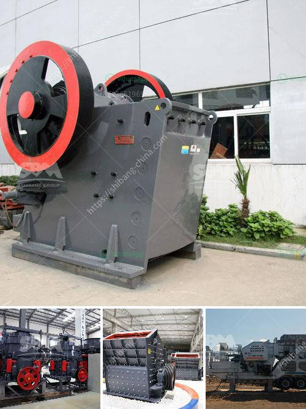

<h3>top 20 coal mining companies in indonesia</h3>
Indonesia is one of the world's largest producers and exporters of coal. The country has abundant reserves of the fossil fuel and is a key player in the global coal mining industry. With its vast potential, Indonesia has attracted many international companies to invest in its coal sector.

1. Adaro Energy - Established in 1982, Adaro Energy is one of Indonesia's largest coal mining companies by production volume. The company operates the largest single-site coal mine in the southern hemisphere, located in South Kalimantan.

2. Bumi Resources - Bumi Resources is one of Indonesia's leading natural resources companies. It is mainly engaged in coal mining and coal-related businesses, including exploration, development, mining, transportation, and marketing.

3. Kaltim Prima Coal - Kaltim Prima Coal (KPC) is the largest coal mining company in Indonesia, operating the Sangatta mine in East Kalimantan.

4. PT Bukit Asam - PT Bukit Asam is a state-owned coal mining company. It operates two mines, namely Tanjung Enim and Ombilin, which produce high-quality coal.

5. Indo Tambangraya Megah - Indo Tambangraya Megah (ITM) is a subsidiary of Banpu Public Company Limited, one of Thailand's largest coal producers. ITM operates several coal mines in Indonesia.

6. PT Bayan Resources - PT Bayan Resources Tbk is a mining company involved in coal production, coal trading, and port services in Indonesia.

7. PT Indika Energy - PT Indika Energy Tbk is an integrated energy company engaged in coal mining, oil and gas exploration, and power generation. It owns several coal mining concessions in Indonesia.

8. PT Toba Bara Sejahtra - PT Toba Bara Sejahtra Tbk is a coal mining company, with its operations mainly located in Central Kalimantan.

9. PT Harum Energy - PT Harum Energy Tbk is an Indonesian coal mining company listed on the Indonesia Stock Exchange. It operates several coal mines in East Kalimantan.

10. PT Adimitra Baratama Nusantara - PT Adimitra Baratama Nusantara is primarily involved in coal mining and trading. Its coal mines are located in South Kalimantan.

11. PT JORONG BARUTAMA GRESTON - PT Jorong Barutama Greston is a coal mining company based in Indonesia. It operates the Jorong Barutama Greston mine in South Kalimantan.

12. PT Medco Energi Mining Internasional - PT Medco Energi Mining Internasional is a subsidiary of PT Medco Energi Internasional Tbk. It is mainly involved in coal mining operations in Indonesia.

13. PT Resource Alam Indonesia - PT Resource Alam Indonesia Tbk is an Indonesian coal mining company engaged in coal exploration, mining, and processing.

14. PT Berau Coal Energy - PT Berau Coal Energy Tbk is a coal mining company focused on the exploration, development, and production of coal in Indonesia. It operates the Binungan mine in East Kalimantan.

15. PT Kideco Jaya Agung - PT Kideco Jaya Agung is a coal mining company, with its operations located in Pasir Regency, East Kalimantan. It is one of Indonesia's largest producers of coal.

16. PT Cakrawala Langit Sejahtera - PT Cakrawala Langit Sejahtera is a coal mining company based in Indonesia. It operates coal mines in Kalimantan and Sumatra.

17. PT Kitadin - PT Kitadin is a coal mining company, part of the Indo Tambangraya Megah group. It operates in East Kalimantan.

18. PT Arutmin Indonesia - PT Arutmin Indonesia is a coal mining company operating in South and East Kalimantan. It is one of the subsidiaries of Bumi Resources Tbk.

19. PT Trubaindo Coal Mining - PT Trubaindo Coal Mining is a coal mining and processing company located in East Kalimantan.

20. PT Tambang Batubara Bukit Asam - PT Tambang Batubara Bukit Asam is a state-owned coal mining company, with its operations located in South Sumatra and South Kalimantan.

These companies play a significant role in Indonesia's coal mining sector, contributing to the country's economic growth and energy needs. With the global demand for coal remaining high, Indonesia's coal industry is expected to continue thriving in the coming years.
<h3>Contact us</h3><ul><li><strong>Whatsapp:&nbsp;<a href="https://wa.me/8613661969651">+8613661969651</a></strong></li><li><a href="https://swt.shibang-china.com/?git&amp;zhl&amp;top 20 coal mining companies in indonesia"><strong>Online Service(chat now)</strong></a></li></ul><h3>Related</h3><ul><li><a href='vertical roller mill suppliers.md'>vertical roller mill suppliers</a></li><li><a href='roll crusher kenya.md'>roll crusher kenya</a></li><li><a href='india crushers association.md'>india crushers association</a></li><li><a href='artificial sand production line.md'>artificial sand production line</a></li><li><a href='small mobile stone crusher.md'>small mobile stone crusher</a></li></ul>