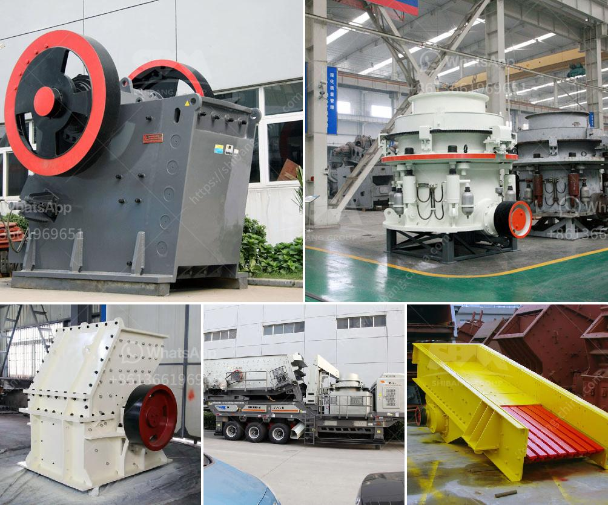

<h3>total gypsum mill production in india</h3>
India, as one of the world's largest gypsum producers, has witnessed a remarkable surge in its gypsum mill production in recent years. This is primarily due to the country's rapidly expanding construction and infrastructure sectors, which have fueled the demand for gypsum and its derivatives. With dedication towards sustainability and innovation, India's gypsum mill production has reached new heights, benefiting both the national economy and the wider populace.

Gypsum, a naturally occurring mineral, finds extensive applications in various industries due to its unique properties. It is primarily used in the construction sector to produce plasterboards, cement, and other building materials. Furthermore, gypsum is also utilized in agriculture as a soil conditioner and fertilizer, as well as in the manufacturing of medical products, dental molds, and food additives.

India boasts abundant gypsum reserves, particularly in the states of Rajasthan, Tamil Nadu, and Jammu & Kashmir, contributing significantly to the nation's gypsum mill production. The country's manufacturers have harnessed these resources effectively, propelling India to become the world's second-largest producer of gypsum after China.

The escalating emphasis on infrastructure development, urbanization, and housing projects has been a major driving force behind India's gypsum mill production surge. Government initiatives such as "Housing for All" and "Smart Cities Mission" have led to an increased demand for affordable housing, resulting in a surge in gypsum consumption for construction purposes.

Moreover, the government's efforts to improve the ease of doing business and attract foreign direct investment have also played a pivotal role in the expansion of the construction sector. This growth has further bolstered the gypsum mill production in India, marking a positive impact on the overall GDP.

While gypsum mill production experiences substantial growth, the industry remains committed to sustainable practices and minimizing its environmental footprint. The manufacturers have adopted advanced technologies to enhance energy efficiency and reduce emissions during the production process. Efforts are made to recycle and reuse gypsum waste, ensuring responsible waste management practices and minimizing environmental impact.

India's gypsum industry has emerged as a key player in the global market. The country's high-quality gypsum products enjoy strong demand from neighboring countries in South Asia, as well as in the Middle East, Southeast Asia, and Africa. Indian manufacturers have gained a reputation for delivering superior quality products at competitive prices, contributing to the nation's export revenue and its standing as a reliable gypsum supplier worldwide.

India's gypsum mill production reflects the nation's unwavering commitment to economic growth, sustainability, and technological advancements. With a strong focus on the construction and infrastructure sectors, the country has witnessed an impressive surge in gypsum consumption, along with the subsequent rise in production. The industry's sustainable practices and global recognition further solidify India's position as a key player in the gypsum market.

Moving forward, continuous investments in research and development, infrastructure, and efficient production techniques will undoubtedly drive India's gypsum mill production to newer heights. As the demand for gypsum continues to rise both on a domestic and international level, it is certain that India's vibrant gypsum industry will play an integral role in shaping the nation's economic growth and development.
<h3>Contact us</h3><ul><li><strong>Whatsapp:&nbsp;<a href="https://wa.me/8613661969651">+8613661969651</a></strong></li><li><a href="https://swt.shibang-china.com/?git&amp;zhl&amp;total gypsum mill production in india"><strong>Online Service(chat now)</strong></a></li></ul><h3>Related</h3><ul><li><a href='ball mill price.md'>ball mill price</a></li><li><a href='ethiopia gypsum manufacturers.md'>ethiopia gypsum manufacturers</a></li><li><a href='sample business plan for stone crusher in bolivia.md'>sample business plan for stone crusher in bolivia</a></li><li><a href='impact pulverizer model sje25.md'>impact pulverizer model sje25</a></li><li><a href='hp ball mill motors.md'>hp ball mill motors</a></li></ul>