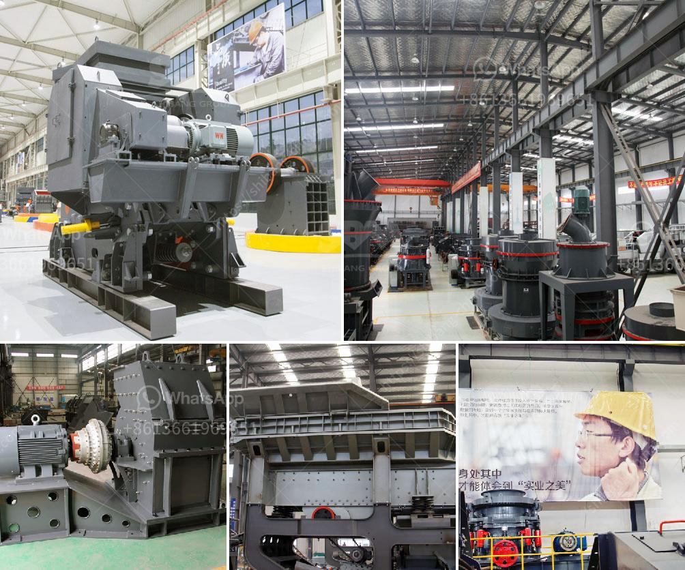

<h3>trommel ball mill</h3>
The trommel ball mill is a cylindrical drum, made of rubber or metal, that rotates on its axis and is primarily used for mining operations. The trommel is designed to separate materials by size, as it rotates, allowing smaller particles to fall through the holes in the drum while larger particles are retained and continue to be broken down by the impact of the grinding media.

One of the key advantages of using a trommel ball mill is its ability to quickly and efficiently grind materials into fine powder. This is achieved due to the cascading motion of the grinding media within the drum, which provides a high impact force and ensures thorough mixing and grinding of the materials.

Additionally, the trommel design allows for easy maintenance and cleaning. The holes in the drum can be easily changed or repaired, allowing for maximum efficiency and reducing downtime. The rubber lining of the drum also helps to reduce noise and vibrations, making for a more comfortable and safer working environment.

In terms of size, the trommel ball mill is available in various capacities, ranging from 100 to 300 tons per hour. This versatility makes it suitable for a wide range of applications, from small-scale mining operations to larger industrial settings.

Overall, the trommel ball mill is a versatile and efficient grinding tool that offers several advantages for mining operations. Its ability to grind materials into fine powder, ease of maintenance, and variety of size options make it a reliable choice for many mining professionals.
<h3>Contact us</h3><ul><li><strong>Whatsapp:&nbsp;<a href="https://wa.me/8613661969651">+8613661969651</a></strong></li><li><a href="https://swt.shibang-china.com/?git&amp;zhl&amp;trommel ball mill"><strong>Online Service(chat now)</strong></a></li></ul><h3>Related</h3><ul><li><a href='jual ball mill second.md'>jual ball mill second</a></li><li><a href='raymond mill for sale.md'>raymond mill for sale</a></li><li><a href='clay processing technology.md'>clay processing technology</a></li><li><a href='portable diamond processing plant supplier.md'>portable diamond processing plant supplier</a></li><li><a href='coal mine equipment manufacturer of india.md'>coal mine equipment manufacturer of india</a></li></ul>