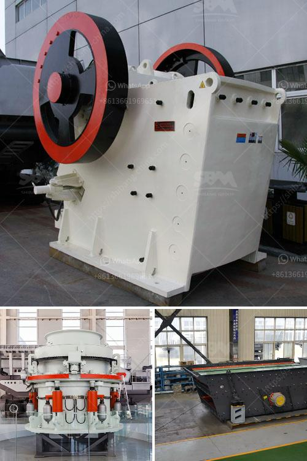

<h3>turkey jaw crushers in istanbul</h3>
Turkey is a growing nation that offers significant opportunities for investment and economic growth. With its strategic location between Europe and Asia, it has become a hub for trade and commerce. One industry that is thriving in Istanbul, Turkey's largest city, is the manufacturing of jaw crushers.

Jaw crushers are machines that are primarily used for crushing rocks and other hard materials. They are widely used in mining, construction, and demolition industries, as well as recycling applications. These crushers have a wide range of use and play a crucial role in various industries.

Istanbul has emerged as a key center for the production of jaw crushers in Turkey. The city offers various advantages that contribute to its growth in this sector. Firstly, Istanbul has a strong workforce with skilled engineers and technicians who are well-versed in the design and manufacturing of these machines. These professionals bring their expertise to create high-quality crushers that meet international standards.

In addition, Istanbul offers excellent transportation and logistics infrastructure, making it convenient for manufacturers to source raw materials and deliver finished products. The city's proximity to major ports and airports also facilitates the export of jaw crushers to international markets.

Furthermore, Istanbul provides access to a vast network of suppliers, which is essential for the production of jaw crushers. Manufacturers can easily source components and parts from local and regional suppliers, ensuring a steady supply chain and reducing production costs.

The growing demand for jaw crushers in Turkey is fueled by the country's increasing infrastructure and construction projects. As Turkey continues to invest in highways, airports, and residential buildings, there is a need for high-quality crushers to break down rocks and stones for construction purposes. Istanbul's growing population and urban development further drive the demand for these machines.

Another factor contributing to the growth of the jaw crusher industry in Istanbul is the emphasis on sustainable development and environmental conservation. Jaw crushers play a vital role in recycling applications, where they are used to process demolished concrete and other materials. Istanbul's commitment to sustainability encourages manufacturers to produce jaw crushers that are energy-efficient and eco-friendly.

The rising popularity of jaw crushers has attracted international investors and companies to Istanbul. Many global manufacturers have established production facilities in the city to take advantage of the growing market. This influx of foreign investment brings advanced technology, innovative designs, and increased competitiveness to the local industry.

In conclusion, jaw crushers are a thriving industry in Istanbul, Turkey. The city's skilled workforce, excellent infrastructure, and access to suppliers contribute to its growth as a manufacturing center for crushers. The increasing demand for these machines in construction and recycling sectors, coupled with Istanbul's commitment to sustainability, further contributes to the industry's success. With the presence of international investors, the future looks bright for the jaw crusher industry in Istanbul.
<h3>Contact us</h3><ul><li><strong>Whatsapp:&nbsp;<a href="https://wa.me/8613661969651">+8613661969651</a></strong></li><li><a href="https://swt.shibang-china.com/?git&amp;zhl&amp;turkey jaw crushers in istanbul"><strong>Online Service(chat now)</strong></a></li></ul><h3>Related</h3><ul><li><a href='portable crusher in malaysia.md'>portable crusher in malaysia</a></li><li><a href='25 used crushing machine price.md'>25 used crushing machine price</a></li><li><a href='study on sand making machine in nigeria.md'>study on sand making machine in nigeria</a></li><li><a href='beneficiation process of clay.md'>beneficiation process of clay</a></li><li><a href='mining company from india.md'>mining company from india</a></li></ul>