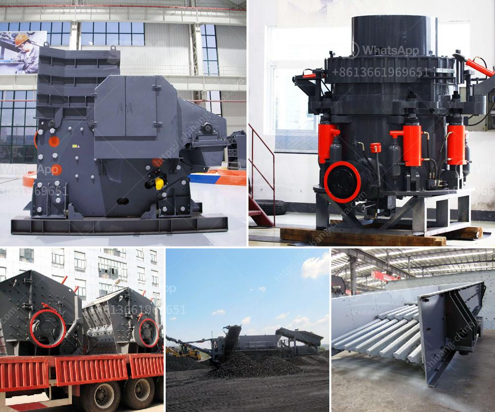

<h3>turkey quarry crusher machines manufacturer</h3>
Title: Turkey's Leading Quarry Crusher Machine Manufacturer: Ensuring Sustainable Infrastructure Growth

Turkey, a rising powerhouse in the construction industry, has been witnessing rapid modernization and infrastructure development in recent years. Behind this commendable growth trajectory is a robust manufacturing sector, including the country's top quarry crusher machine manufacturers. Among these, the leading player is distinguished for its innovation, quality, and commitment to sustainable construction practices. In this article, we delve into the achievements and contributions of Turkey's finest quarry crusher machines manufacturer.

Turkey's quarry crusher machines manufacturer stands out for its dynamic participation in research and development (R&D). With modern manufacturing facilities and a team of highly skilled engineers, the company continuously explores cutting-edge technologies to improve its machinery's design and performance. By investing in advanced research activities, this manufacturer ensures that its machines are at the forefront of the industry, capable of meeting the demands of even the most challenging quarrying projects.

The manufacturer sets high standards for the quality of its machines, adhering to stringent quality control procedures at every stage of production. The company's commitment to producing reliable quarry crusher machines has earned it a stellar reputation among construction professionals. By using premium-grade materials and rigorous testing methods, the manufacturer guarantees the durability and longevity of its machinery, resulting in fewer breakdowns, lower maintenance costs, and higher operational efficiency for quarrying operations.

Recognizing the importance of environmental sustainability, Turkey's leading quarry crusher machine manufacturer takes active steps to minimize its ecological footprint. These include integrating eco-friendly features into the design of its machines, such as energy-saving motors and efficient dust collection systems. Furthermore, the company implements environmentally responsible manufacturing practices, such as proper waste management and recycling initiatives, to ensure a greener production process. By prioritizing sustainability, the manufacturer contributes to Turkey's commitment to building a more sustainable future.

The manufacturer places significant emphasis on customer satisfaction, understanding that the success of its clients' operations directly impacts its own. By engaging in thorough consultation with customers, the company identifies their unique requirements and tailors its quarry crusher machines accordingly. Moreover, the manufacturer provides comprehensive after-sales support, including operator training, maintenance services, and readily available spare parts. This customer-centric approach not only strengthens long-term partnerships but also enables effective knowledge transfer, ensuring optimal utilization of the machinery and improved project outcomes.

Turkey's leading quarry crusher machine manufacturer has solidified its position in the global market through its commitment to excellence and continuous improvement. The company exports its products to numerous countries worldwide, demonstrating its ability to meet international standards and customers' varying needs. Furthermore, the manufacturer actively showcases its innovative machinery in prominent construction trade shows, raising its profile and gaining recognition as a trusted and dependable supplier.

Turkey's quarry crusher machines manufacturer plays a crucial role in the country's infrastructure development. With its technical excellence, commitment to quality, sustainable practices, and customer-centric approach, the company is at the forefront of the industry. By continuously improving its machinery and contributing to Turkey's vision of sustainable construction, this manufacturer ensures the growth and success of construction projects while preserving the environment for future generations.
<h3>Contact us</h3><ul><li><strong>Whatsapp:&nbsp;<a href="https://wa.me/8613661969651">+8613661969651</a></strong></li><li><a href="https://swt.shibang-china.com/?git&amp;zhl&amp;turkey quarry crusher machines manufacturer"><strong>Online Service(chat now)</strong></a></li></ul><h3>Related</h3><ul><li><a href='sand crusher machinery china.md'>sand crusher machinery china</a></li><li><a href='grinding mill machine in sri lanka.md'>grinding mill machine in sri lanka</a></li><li><a href='zircon sand production line price.md'>zircon sand production line price</a></li><li><a href='cement production plant.md'>cement production plant</a></li><li><a href='stone crusher in subic.md'>stone crusher in subic</a></li></ul>