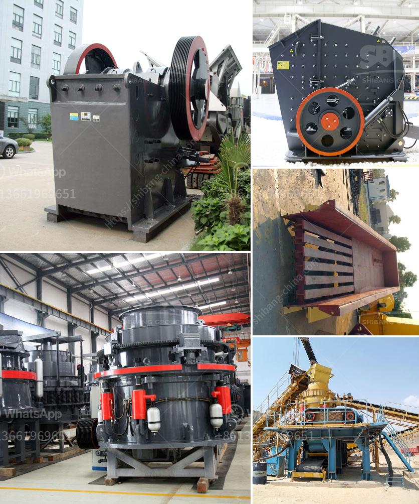

<h3>turnkey consultant for calcium carbonate plant in india</h3>
India is one of the largest producers of calcium carbonate worldwide, making it an ideal location for setting up a calcium carbonate plant. However, starting a new plant can be a complex task involving various challenges such as obtaining permits, sourcing raw materials, equipment installation, and ensuring compliance with regulatory guidelines. That's where a turnkey consultant can play a crucial role in ensuring a smooth and successful setup of the calcium carbonate plant.

A turnkey consultant acts as a one-stop solution provider, managing all aspects of the project from inception to completion. They take complete responsibility for the project, including designing, procuring and installing processing equipment, staffing, and managing the plant. Their extensive knowledge and experience in the industry can significantly expedite the setup process and minimize the risk involved.

1. Expertise and Guidance: Turnkey consultants have in-depth knowledge of the calcium carbonate industry. They understand the technicalities of the production process, including milling, coating, and packaging. Their expertise enables them to guide plant owners in making well-informed decisions related to equipment selection, process optimization, and cost-effective solutions for maximizing productivity.

2. Regulatory Compliance: The calcium carbonate industry is subject to various regulations and environmental standards that must be met for legal operation. A turnkey consultant familiar with the local regulations will ensure that the plant is designed and operated in compliance with all necessary permits, licenses, and environmental norms. This helps plant owners avoid costly penalties and streamline the start-up process.

3. Efficient Project Management: Setting up a calcium carbonate plant involves handling multiple tasks simultaneously. A turnkey consultant oversees the entire project, prioritizing activities, allocating resources, and managing timelines to ensure timely completion. Their project management skills help minimize delays and cost overruns, resulting in a more efficient operation.

4. Cost Optimization: Turnkey consultants use their industry expertise to identify cost-saving opportunities at every stage of the project. They have established relationships with suppliers, enabling them to negotiate better deals on raw materials, equipment, and other resources. By optimizing costs, they help plant owners achieve the desired efficiency and profitability.

5. Training and Staffing: A turnkey consultant assists in recruiting and training the plant's workforce, ensuring they are well-versed in the specialized equipment and production processes. This ensures a smooth transition from installation to operation, reducing downtime and increasing overall plant efficiency.

Setting up a calcium carbonate plant in India requires expertise, resources, and meticulous planning. Hiring a turnkey consultant provides numerous advantages, such as comprehensive project management, technical expertise, regulatory compliance, and cost optimization. With their knowledge and experience, they can help plant owners navigate through the complexities of the setup process, minimize risks, and achieve operational success in a more streamlined and efficient manner.
<h3>Contact us</h3><ul><li><strong>Whatsapp:&nbsp;<a href="https://wa.me/8613661969651">+8613661969651</a></strong></li><li><a href="https://swt.shibang-china.com/?git&amp;zhl&amp;turnkey consultant for calcium carbonate plant in india"><strong>Online Service(chat now)</strong></a></li></ul><h3>Related</h3><ul><li><a href='industrial application of ball mills.md'>industrial application of ball mills</a></li><li><a href='ball mill manufacturer in bhayander.md'>ball mill manufacturer in bhayander</a></li><li><a href='ball mill machine india.md'>ball mill machine india</a></li><li><a href='crushing concrete materials rates in pakistan.md'>crushing concrete materials rates in pakistan</a></li><li><a href='stone crushers from china.md'>stone crushers from china</a></li></ul>