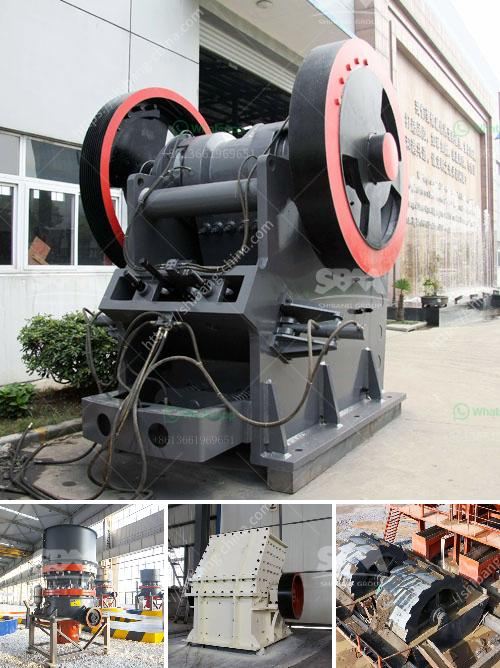

<h3>twist of the ball mill</h3>
The ball mill is a commonly used grinding machine in many industries. Its popular because of its cost-effective nature and its ability to grind materials into fine particles. With a twist in its functionality, the ball mill machine can be used for either wet or dry grinding purposes. So, whether you're grinding material in wet conditions or dry conditions, the ball mill is designed to handle both scenarios efficiently.

Traditionally, the ball mill operates with a rotating drum and grinding media like steel balls, which come into direct contact with the material being ground. This grinding method is known as impact grinding, and it's highly effective in reducing the size of particles. However, with recent advancements, a twist has been introduced to the ball mill design.

The twist lies in the addition of a secondary grinding mechanism called a ball mill agitator. This secondary grinding mechanism enhances the grinding process by stirring the material and the grinding media together. It enables a more efficient and homogenous grinding of the material, resulting in a finer product.

The ball mill agitator consists of a series of rotating arms or blades that are attached to the shaft or drum of the ball mill. As the drum spins, the agitator rotates, causing the grinding media and the material to mix and collide. This action generates a powerful mechanical force that enhances the grinding process and ensures a more uniform distribution of particles.

The addition of a ball mill agitator brings several advantages to the traditional ball mill design. Firstly, it improves the grinding efficiency by promoting a more thorough mixing of the material and the grinding media. This leads to a reduction in the required grinding time and energy consumption. As a result, the ball mill with a twist offers significant cost-saving benefits for industrial operations.

Furthermore, the ball mill agitator also helps to reduce the risk of uneven wear and tear on the grinding media. With traditional grinding methods, the grinding media may wear out more rapidly in certain areas, leading to inefficient grinding and uneven particle size distribution. However, the addition of the ball mill agitator helps to distribute the grinding media more evenly, minimizing the localized wear and tear, and ensuring a more consistent grinding performance.

In conclusion, the twist of adding a ball mill agitator to the traditional ball mill design has proven to be a game-changer in the grinding industry. This enhancement brings numerous benefits, including improved grinding efficiency, reduced energy consumption, and more uniform particle size distribution. Whether you're grinding materials in wet or dry conditions, the ball mill with a twist is a reliable and cost-effective choice for various applications.
<h3>Contact us</h3><ul><li><strong>Whatsapp:&nbsp;<a href="https://wa.me/8613661969651">+8613661969651</a></strong></li><li><a href="https://swt.shibang-china.com/?git&amp;zhl&amp;twist of the ball mill"><strong>Online Service(chat now)</strong></a></li></ul><h3>Related</h3><ul><li><a href='quartz ball mill manufacturer hyderabad.md'>quartz ball mill manufacturer hyderabad</a></li><li><a href='milling machine grinding mill.md'>milling machine grinding mill</a></li><li><a href='used stone crusher in usa for sale.md'>used stone crusher in usa for sale</a></li><li><a href='industria de la piedra caliza en m.md'>industria de la piedra caliza en m</a></li><li><a href='gypsum grinding machine.md'>gypsum grinding machine</a></li></ul>