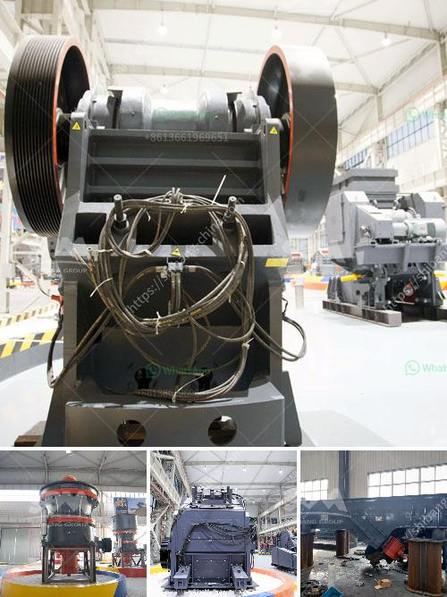

<h3>types coal ball mill</h3>
A coal ball mill is a type of grinder used to grind materials into extremely fine powder. It is used especially for grinding bituminous coal, anthracite, lignite, petcoke, and many other coals for fuel in power plants, cement plants, and steel plants. In order to do efficient grinding, the ball mill must be operated in a closed system, with oversize particles continuously being recirculated back to the mill for further grinding.

There are three main types of coal ball mill: air-swept ball mill, semi-wet ball mill, and wet ball mill. Each type of coal ball mill has its own advantages and characteristics.

Air-swept coal ball mill is the main equipment in cement plant for both drying and grinding of the powders. Compared with the ordinary ball mill, it has advantages of higher capacity, more convenient operation, safer usage, and more reliable performance. Coal mill is used to grind, pulverize and dry coal before the coal is transmitted the boiler. The coal is fed into the coal mill via a inlet pipe so that the coal mill can pulverize the coal into particles.

Semi-wet coal ball mill is a new type of equipment developed by our company for grinding coal. This coal grinding mill consists of transmission device, frame, rotating part, discharging device, raw material storage hopper and control system. It has high grinding efficiency and is energy-saving.

The wet coal ball mill is mainly used to grind coal. It is very suitable for huge grinding projects. With water supplying it achieves the purpose of cooling and cleaning the grinding material during the grinding process.

In summary, the coal ball mill can be used to grind various coals with high grinding efficiency, reliable performance, and low maintenance cost. It is an ideal device for the grinding and drying of coal in power plants, cement plants, and steel plants. Choosing a suitable type of coal ball mill can enhance the production efficiency and energy-saving of the grinding system.
<h3>Contact us</h3><ul><li><strong>Whatsapp:&nbsp;<a href="https://wa.me/8613661969651">+8613661969651</a></strong></li><li><a href="https://swt.shibang-china.com/?git&amp;zhl&amp;types coal ball mill"><strong>Online Service(chat now)</strong></a></li></ul><h3>Related</h3><ul><li><a href='distribuidores de equipo de trituracion extec.md'>distribuidores de equipo de trituracion extec</a></li><li><a href='mobile stone crusher for sale.md'>mobile stone crusher for sale</a></li><li><a href='buy sand washing plant in sri lanka.md'>buy sand washing plant in sri lanka</a></li><li><a href='dental stone jaw crusher.md'>dental stone jaw crusher</a></li><li><a href='crushing stones for gold.md'>crushing stones for gold</a></li></ul>