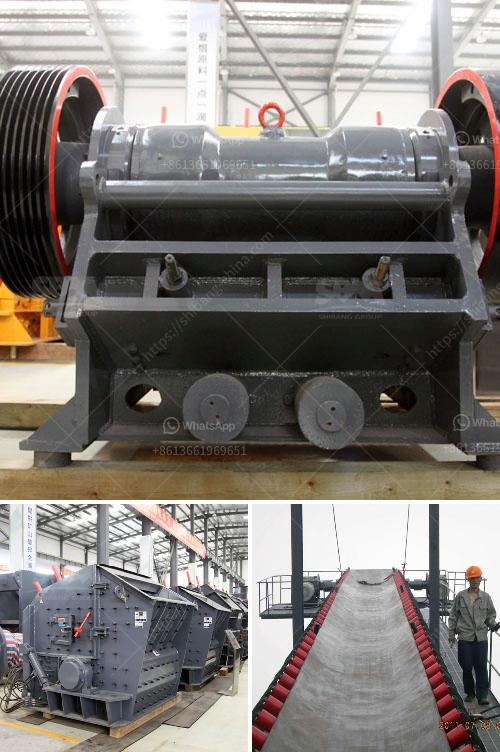

<h3>types of equipments used in cement industry</h3>
The cement industry utilizes a wide range of equipment to produce and deliver the final product. Different types of machinery are used at each step of the manufacturing process to ensure efficient production and consistent quality.

One of the key pieces of equipment in cement manufacturing is the kiln. It is a large cylindrical furnace that rotates while the raw materials are heated at high temperatures. The kiln plays a crucial role in the chemical reactions that transform the raw materials into clinker, which is the intermediate product used to produce cement.

Another essential piece of equipment is the ball mill. It grinds the clinker into fine powder, providing the final cement product. Ball mills use a rotating drum filled with steel balls to pulverize the clinker material and ensure thorough blending and grinding.

Cement plants also rely on crushers to break down the clinker into smaller pieces. Crushers are instrumental in reducing the size of the raw materials and ensuring that they can be processed further. Various types of crushers, including jaw crushers and hammer mills, are used depending on the clinker hardness and desired output.

Conveyors are employed to transport the crushed clinker and other materials throughout the plant. They are especially useful in automating the production process and streamlining operations. Belt conveyors, pneumatic conveyors, and bucket elevators are commonly used in the cement industry.

In addition to these primary pieces of equipment, cement plants may employ various other machines and tools, such as separators, cyclone collectors, and storage silos. Each equipment has a specific role in the cement manufacturing process, contributing to the overall efficiency and quality of the final product.

In conclusion, the cement industry relies on a range of equipment to produce cement. From kilns and ball mills to crushers and conveyors, each piece of machinery plays a vital role in ensuring efficient production and consistent product quality. By understanding the various types of equipment used, cement manufacturers can optimize their processes and deliver high-quality cement to meet the demands of the construction industry.
<h3>Contact us</h3><ul><li><strong>Whatsapp:&nbsp;<a href="https://wa.me/8613661969651">+8613661969651</a></strong></li><li><a href="https://swt.shibang-china.com/?git&amp;zhl&amp;types of equipments used in cement industry"><strong>Online Service(chat now)</strong></a></li></ul><h3>Related</h3><ul><li><a href='stone crusher for sales in south philippines.md'>stone crusher for sales in south philippines</a></li><li><a href='stone crushing plant of germany.md'>stone crushing plant of germany</a></li><li><a href='cone crusher price in china.md'>cone crusher price in china</a></li><li><a href='portable crusher in malaysia.md'>portable crusher in malaysia</a></li><li><a href='stone crushing plant supplier south africa.md'>stone crushing plant supplier south africa</a></li></ul>