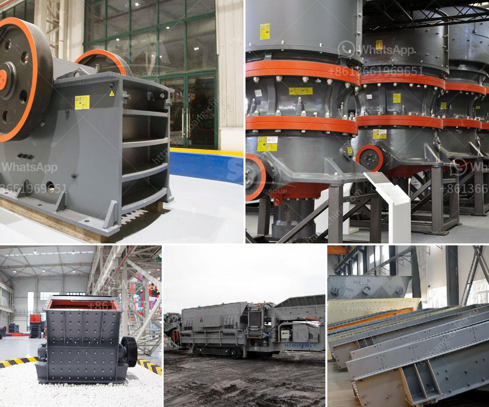

<h3>ultrafine mill in china</h3>
China has always been a country rich in mineral resources. The emergence of a large number of mining enterprises has promoted the rapid development of the country's economy. With the continuous advancement of technology, a new type of grinding equipment - the ultrafine mill - has revolutionized the mining industry in China.

The ultrafine mill is a specialized equipment for processing and manufacturing fine powder and ultrafine powder. It mainly grinds raw materials into fine particles, making them easy to be processed and utilized. As an advanced equipment for the development of the powder industry, the ultrafine mill has many advantages.

Firstly, the ultrafine mill has a wider range of applications. It can be used in various industries such as mining, metallurgy, chemical industry, building materials, and more. The ultrafine mill can grind different hardness materials, which greatly expands the scope of its application. It has become an essential equipment in the mining industry.

Secondly, the ultrafine mill has high production efficiency. It adopts a multi-layer grinding ring design, which greatly improves the grinding efficiency. The ultrafine mill can grind the materials three times finer than other grinding equipment, thus significantly increasing the production capacity. This high efficiency not only saves labor costs but also helps enterprises achieve higher output and greater profits.

Thirdly, the ultrafine mill has excellent environmental performance. The dust removal system of the ultrafine mill adopts advanced pulse bag filter technology, which effectively eliminates dust pollution. It strictly complies with the emission standards of the environmental protection department, reducing the harm caused by dust to human health and the environment. This makes the ultrafine mill a green and environmentally friendly equipment, in line with the development trend of the times.

In addition, the ultrafine mill has a compact structure and occupies a small area, which saves production space for enterprises. It is equipped with a sound insulation and noise reduction system, effectively reducing noise pollution in the workplace. The ultrafine mill also has a good sealing performance, preventing dust leakage and further protecting the environment.

The ultrafine mill in China is constantly being upgraded and improved. Many manufacturers are committed to research and development, with the goal of producing more advanced and efficient ultrafine mills. They actively introduce foreign advanced technology, continuously optimize the machine structure and performance, and strive to achieve better grinding efficiency and product quality.

In conclusion, the ultrafine mill has played a significant role in the transformation of the mining industry in China. Its wide range of applications, high production efficiency, excellent environmental performance, and compact structure have been recognized by the industry. As China continues to develop, the ultrafine mill will continue to innovate and contribute to the sustainable development of the mining industry.
<h3>Contact us</h3><ul><li><strong>Whatsapp:&nbsp;<a href="https://wa.me/8613661969651">+8613661969651</a></strong></li><li><a href="https://swt.shibang-china.com/?git&amp;zhl&amp;ultrafine mill in china"><strong>Online Service(chat now)</strong></a></li></ul><h3>Related</h3><ul><li><a href='iron processing equipment cost.md'>iron processing equipment cost</a></li><li><a href='quick lime hammer crusher.md'>quick lime hammer crusher</a></li><li><a href='used steel ball mill.md'>used steel ball mill</a></li><li><a href='small operations rock crushing equipment for sale.md'>small operations rock crushing equipment for sale</a></li><li><a href='stone crusher plant for sale in pakistan.md'>stone crusher plant for sale in pakistan</a></li></ul>