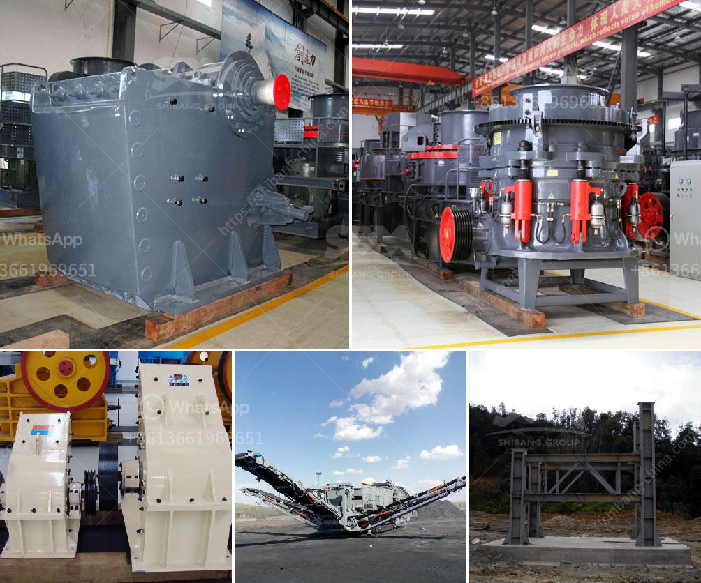

<h3>usa used equipment grinding mill 100tph 200 mesh</h3>
The grinding mill is an essential tool used in the industrial sector for material processing. In the United States, there is a growing demand for used equipment that proves to be cost-effective while maintaining efficient performance. USA used equipment grinding mills, specifically the 100 TPH model capable of producing 200 mesh sized particles, offer numerous advantages to industries requiring finely ground materials. In this article, we will discuss the benefits and features of this particular grinding mill.

The USA used equipment grinding mill 100 TPH offers a significant boost in productivity for industries requiring finely ground materials. With a capacity of 100 TPH, it ensures efficient grinding operations while maintaining optimum output. The ability to produce 200 mesh-sized particles makes it suitable for various applications such as mineral processing, construction, and chemical industries, among others.

Investing in used equipment has become a popular choice for businesses looking to maximize their ROI. The USA used equipment grinding mill offers a cost-effective alternative without compromising on performance. By purchasing a pre-owned mill, businesses can significantly reduce their initial investment, allowing for more affordable operations. The availability of such equipment provides an opportunity for smaller businesses or startups to enter the market with minimized financial risks.

The USA used equipment grinding mill 100 TPH can be tailored to meet specific industry requirements, offering a high degree of versatility. Industries often have unique material characteristics that require customized grinding processes. This grinding mill model can be easily adjusted to accommodate diverse input materials and desired output sizes, enabling businesses to cater to a wide range of client needs.

Despite being used equipment, the USA grinding mill 100 TPH assures reliable and consistent performance. The equipment's durability and robust design ensure prolonged operational life and minimal maintenance requirements. This longevity allows businesses to optimize their production processes without worrying about frequent breakdowns or costly repairs.

The USA used equipment grinding mill 100 TPH, capable of producing 200 mesh-sized particles, offers an efficient and cost-effective solution for industries requiring finely ground materials. With enhanced productivity, customization options, and proven performance, businesses can confidently invest in this reliable grinding mill. The availability of pre-owned equipment allows companies to minimize their initial investment while maintaining the desired level of performance. By choosing this model, businesses can streamline their operations while meeting the demands of various applications within the industrial sector.
<h3>Contact us</h3><ul><li><strong>Whatsapp:&nbsp;<a href="https://wa.me/8613661969651">+8613661969651</a></strong></li><li><a href="https://swt.shibang-china.com/?git&amp;zhl&amp;usa used equipment grinding mill 100tph 200 mesh"><strong>Online Service(chat now)</strong></a></li></ul><h3>Related</h3><ul><li><a href='grinding equipment for cement plant.md'>grinding equipment for cement plant</a></li><li><a href='components for cone crusher major.md'>components for cone crusher major</a></li><li><a href='crusher equipment dubai.md'>crusher equipment dubai</a></li><li><a href='limestone beneficiation.md'>limestone beneficiation</a></li><li><a href='gold crushing plant.md'>gold crushing plant</a></li></ul>