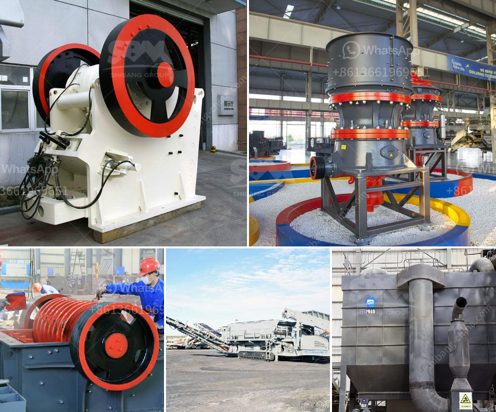

<h3>usa vertical roller mill</h3>
The United States of America (USA) is a technological powerhouse and a major player in various industries. One of the industries that the USA is known for is the manufacturing sector, which includes the production of heavy machinery and equipment. One such piece of equipment that has gained significant recognition in recent years is the vertical roller mill.

A vertical roller mill is a type of industrial equipment used to crush or grind materials into small particles. These machines consist of a large, rotating drum that contains a series of grinding balls that grind the material as it passes through the drum. The vertical roller mill has several benefits over traditional ball mill systems including:

1. Energy Efficiency: The vertical roller mill uses 30-50% less energy than ball mill systems, which means it can offer substantial cost savings. This is especially important in industries that are energy-intensive such as cement and mining.

2. Space Efficiency: Since the vertical roller mill requires less space than a traditional ball mill system, it is highly suitable for small to medium-sized factories or plants.

3. Versatility: Vertical roller mills are capable of grinding a wide range of materials, such as cement clinker, slag, coal, and minerals. This versatility is beneficial for industries that require flexibility in product specifications and composition.

4. Consistency: The vertical roller mill ensures a consistent particle size distribution, which means that the product quality remains constant throughout the grinding process. This is crucial for industries that rely on precise and consistent particle sizes, such as the pharmaceutical or chemical sectors.

5. Easy Maintenance: Vertical roller mills are designed for easy maintenance, with replaceable wear parts and a simplified design that allows for quick and trouble-free inspection and replacement.

The adoption of vertical roller mills in the USA has been steadily increasing over the years due to these numerous advantages. Many companies in the cement and mining industries have switched to vertical roller mills to improve their efficiency and reduce their environmental impact.

In addition to the technological advantages, the USA is also home to several leading manufacturers of vertical roller mills. These companies not only provide high-quality equipment but also offer comprehensive after-sales service and support. This ensures that customers can rely on a reliable supply chain and technical assistance whenever needed.

Looking ahead, the adoption of vertical roller mills is expected to continue growing in the USA as industries seek ways to improve operational efficiency and reduce energy consumption. Additionally, the development of new materials and technologies, such as advanced control systems and innovative grinding media, will further enhance the performance and sustainability of vertical roller mills.

In conclusion, the vertical roller mill is a game-changer in the manufacturing industry. Its energy efficiency, space efficiency, versatility, consistency, and easy maintenance make it a preferred choice for various applications. As USA manufacturers continue to invest in this technology, we can expect significant advancements in the way materials are processed and ground, leading to a more sustainable and efficient future.
<h3>Contact us</h3><ul><li><strong>Whatsapp:&nbsp;<a href="https://wa.me/8613661969651">+8613661969651</a></strong></li><li><a href="https://swt.shibang-china.com/?git&amp;zhl&amp;usa vertical roller mill"><strong>Online Service(chat now)</strong></a></li></ul><h3>Related</h3><ul><li><a href='how to start a sand mining business in south africa.md'>how to start a sand mining business in south africa</a></li><li><a href='gold stone crusher and separator.md'>gold stone crusher and separator</a></li><li><a href='quarry crusher for sale in nigeria.md'>quarry crusher for sale in nigeria</a></li><li><a href='stone crusher in subic.md'>stone crusher in subic</a></li><li><a href='used silica crushing plants for sale.md'>used silica crushing plants for sale</a></li></ul>