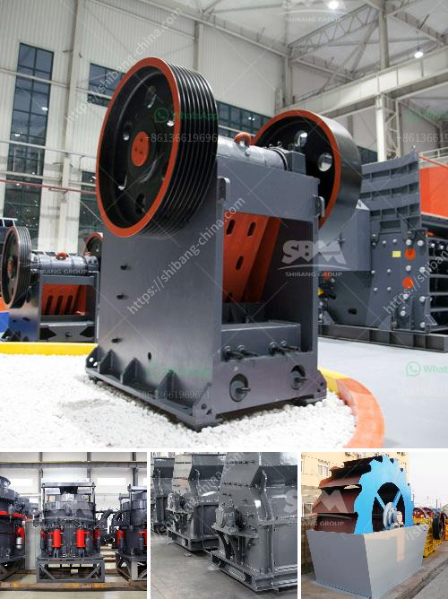

<h3>used asphalt plants for sale in japan</h3>
If you are in the construction or road maintenance industry, you might be looking for ways to optimize your operations and reduce costs. One way to achieve this is by investing in a high-quality, used asphalt plant. Japan, renowned for its advanced technology and precision engineering, offers a great market for used asphalt plants for sale. With a wide range of options available, finding the perfect plant to suit your specific needs and budget is easier than ever.

When considering purchasing a used asphalt plant, it is crucial to understand the benefits it can bring to your construction projects. First and foremost, it allows you to save a significant amount of money. By opting for a used plant, you can acquire cutting-edge machinery at a fraction of the cost of a new one. This cost-effectiveness will not only boost your bottom line but also allow you to allocate your financial resources to other vital aspects of your operations.

Another advantage of investing in a used asphalt plant is the quick availability of the equipment. Unlike new plants that often have long lead times due to manufacturing and shipping processes, used plants are readily available for immediate use. This is particularly advantageous if you have time-sensitive projects that require urgent asphalt production and deployment. With a used plant, you can quickly set it up, start production, and meet your project deadlines without delay.

Moreover, used asphalt plants from Japan are renowned for their durability and reliability. Japanese manufacturers adhere to strict quality standards, ensuring that their machinery is robust and able to withstand the demands of heavy production. Even though a used plant may have been previously operated, Japanese engineering ensures that it remains in excellent working condition. Regular inspections, maintenance, and refurbishments guarantee that the plant operates optimally, delivering high-quality asphalt consistently.

Finding used asphalt plants for sale in Japan has never been easier. With various platforms available online, you can browse a wide selection of plants from reputable sellers without leaving the comfort of your home or office. These platforms enable you to compare various models and specifications to choose the one that best fits your requirements. Additionally, you can communicate directly with the sellers, ask questions, and request additional information and documentation to make an informed decision.

In conclusion, considering a used asphalt plant for your construction or road maintenance projects can be a practical and cost-effective solution. With Japan's reputation for technology excellence, investing in a used asphalt plant manufactured in Japan ensures exceptional quality, durability, and longevity. By opting for used machinery, you can save money and benefit from quick availability. So, take advantage of the extensive range of used asphalt plants for sale in Japan and propel your operations to new heights of efficiency and profitability.
<h3>Contact us</h3><ul><li><strong>Whatsapp:&nbsp;<a href="https://wa.me/8613661969651">+8613661969651</a></strong></li><li><a href="https://swt.shibang-china.com/?git&amp;zhl&amp;used asphalt plants for sale in japan"><strong>Online Service(chat now)</strong></a></li></ul><h3>Related</h3><ul><li><a href='price of zenith jaw crusher.md'>price of zenith jaw crusher</a></li><li><a href='harga pasaran stone crusher.md'>harga pasaran stone crusher</a></li><li><a href='copper ore concentrator price.md'>copper ore concentrator price</a></li><li><a href='stone crusher mini.md'>stone crusher mini</a></li><li><a href='crusher stone crusher 1 ton peru.md'>crusher stone crusher 1 ton peru</a></li></ul>