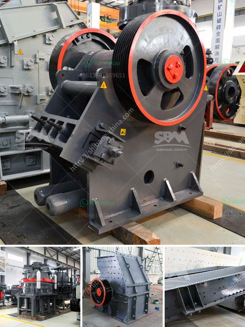

<h3>used cement grinding mill for sale in uae</h3>
Used cement grinding mills are commonly used in processing concrete, clinker and other materials in the construction industry. Vertical roller mills and ball mills represent two evidently distinct technologies. However, with proper adjustments to the operational parameters of the vertical roller mill, the cement grinding mill can be transformed into a reliable and energy-efficient equipment for grinding hard materials.

The used cement grinding mill for sale in UAE is provided by Zenith and it's widely used in many practical fields. Zenith is a professional production Stone grinding plant(Used cement grinding mill for sale in UAE) manufacturers,We have a wealth of experience and the most advanced technology. With a wide range of products and excellent quality, we could provide you with professional after-sales service and support.

Grinding process is highly energy-intensive, and the energy efficiency of the grinding mill is crucial for reducing the electricity cost. The efficient grinding of clinker in a ball mill is an important prerequisite for successful cement production. However, inconsistent feeding or improper feeding of the mill can cause fluctuations in the grinding process, leading to excessive wear of the grinding media or even blockage of the mill.

Therefore, when selecting a cement grinding mill for sale in UAE, the buyer should consider the factors such as the site condition, energy consumption, grinding capacity, and equipment reliability. Zenith provides a complete range of cement grinding mill for sale, including ball mill, high pressure mill, vertical roller mill, raymond mill and so on.

If you are interested, please feel free to contact us. Zenith has been dedicated in cement processing technology for long history. We developed complete range of cement production plant, including crusher plant, ball mill, vertical roller mill, rotary kiln etc. There are also used cement grinding mill for small scale cement production project. Zenith stone quarrying plant has been created compact in arrangement and easy for operation. SBM can supply the whole set of limestone processing equipments with excellent performance.

In conclusion, the used cement grinding mill for sale in UAE is subjected to strict inspections. Therefore, it is highly reliable and offers a long-term guarantee. With the continuous development of the UAE economy, the demand for cement has increased and the competition in the market has become fierce. The used cement grinding mill for sale in UAE can be widely applied to gypsum, talc, calcite, limestone, marble, feldspar, barite, dolomite, granite, kaolin, bauxite, fly ash , oxidation iron oxide red, iron ore, etc..
<h3>Contact us</h3><ul><li><strong>Whatsapp:&nbsp;<a href="https://wa.me/8613661969651">+8613661969651</a></strong></li><li><a href="https://swt.shibang-china.com/?git&amp;zhl&amp;used cement grinding mill for sale in uae"><strong>Online Service(chat now)</strong></a></li></ul><h3>Related</h3><ul><li><a href='hard rock gold mining equipment.md'>hard rock gold mining equipment</a></li><li><a href='quarry crushing machine.md'>quarry crushing machine</a></li><li><a href='basalt manufacturer crusher machine.md'>basalt manufacturer crusher machine</a></li><li><a href='concrete crusher machine for sale.md'>concrete crusher machine for sale</a></li><li><a href='stone crusher to buy in bangalore.md'>stone crusher to buy in bangalore</a></li></ul>