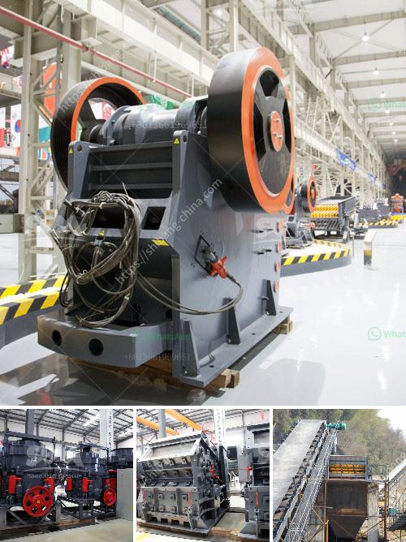

<h3>used cement plants sale germany</h3>
Germany, renowned for its engineering excellence and industrial prowess, has long been a driving force in the global cement industry. As the country transitions toward more sustainable and eco-friendly practices, the demand for used cement plants for sale in Germany has significantly increased. This surge in demand is driven by various factors, including cost-effectiveness, reduced environmental impact, and the desire to revamp existing infrastructure.

One of the primary reasons behind the high demand for used cement plants in Germany is their cost-effectiveness. Used plants often come at a fraction of the price of a new facility, serving as an attractive option for businesses seeking affordable yet reliable manufacturing capabilities. Additionally, purchasing a used cement plant can offer significant savings on assembly and installation costs, enabling businesses to allocate their resources more efficiently.

Germany's commitment to achieving its climate goals has intensified the need for sustainable manufacturing practices. The purchase of used cement plants allows companies to recycle existing infrastructure, reducing the environmental impact associated with the production of new machinery. Repurposing and refurbishing used plants aligns with Germany's objectives to minimize waste and limit the extraction of raw materials, making it an ideal choice for businesses looking to adopt greener practices.

As one of the most advanced economies in the world, Germany places great importance on modernizing and upgrading its infrastructure. There is a constant need for expanding and updating existing cement production capacities to meet growing demand. Purchasing used cement plants enables companies to quickly expand their capacities or replace outdated equipment to maintain operational efficiency. This revitalization process helps ensure that Germany's infrastructure remains robust and up to date.

Germany is renowned for its technological expertise, and this applies to the cement industry as well. The availability of used cement plants allows businesses to access and benefit from advanced technologies that may have been developed after the installation of their existing facilities. These advanced technologies can enhance production efficiency, reduce energy consumption, and improve product quality, giving businesses a competitive edge in the market.

In conclusion, the sale of used cement plants in Germany has become increasingly popular due to their cost-effectiveness, reduced environmental impact, and the opportunity to modernize and upgrade existing infrastructure. With Germany's emphasis on sustainability and technological advancement, purchasing used plants aligns perfectly with the country's objectives. As the demand for cement continues to rise, the market for used cement plants is expected to flourish, contributing to the growth and progress of Germany's construction industry while facilitating a more sustainable future for the sector.
<h3>Contact us</h3><ul><li><strong>Whatsapp:&nbsp;<a href="https://wa.me/8613661969651">+8613661969651</a></strong></li><li><a href="https://swt.shibang-china.com/?git&amp;zhl&amp;used cement plants sale germany"><strong>Online Service(chat now)</strong></a></li></ul><h3>Related</h3><ul><li><a href='manufactures hammer mills.md'>manufactures hammer mills</a></li><li><a href='ball mill in romania italy.md'>ball mill in romania italy</a></li><li><a href='marchine stone crusher cost in kenya.md'>marchine stone crusher cost in kenya</a></li><li><a href='quote for vsi crusher.md'>quote for vsi crusher</a></li><li><a href='indonesia jaw crusher.md'>indonesia jaw crusher</a></li></ul>