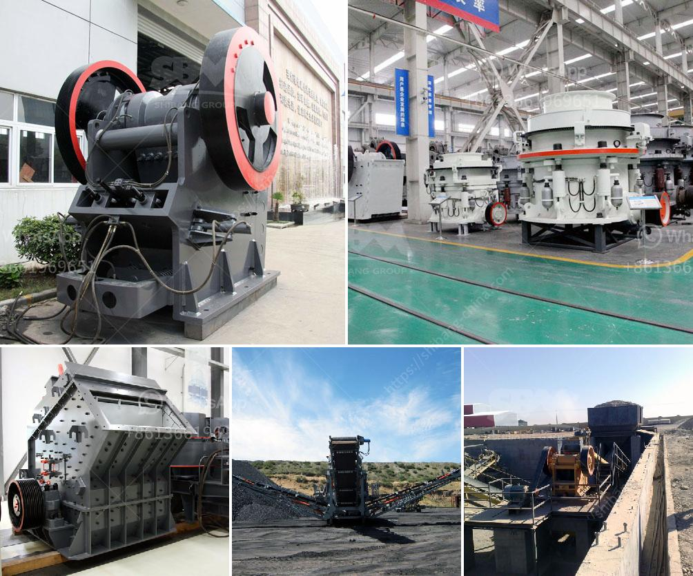

<h3>used clay grinding machine for sale</h3>
Are you in the market for a used clay grinding machine? If so, you're in luck! There are many options available for you to choose from, all at affordable prices. In this article, we will explore the benefits of purchasing a used clay grinding machine and provide some valuable tips to help you make an informed decision.

One of the main advantages of buying a used clay grinding machine is the cost savings. Used machinery tends to be significantly cheaper than new equipment, allowing you to acquire the necessary tools without exceeding your budget. With the money saved, you can invest in other areas of your business or explore additional machinery options.

Moreover, used machinery often retains its original performance capabilities, meaning that you can still expect efficient and reliable operation from a used clay grinding machine. Many sellers thoroughly inspect and refurbish the machines before putting them up for sale, ensuring that they function optimally. Make sure to verify the condition of the machine with the seller and ask for any necessary documentation to support their claims.

When searching for a used clay grinding machine, it's essential to research the different brands and models available. Each machine offers unique features and specifications that may be better suited to your specific needs. Consider factors such as grinding capacity, motor power, and maintenance requirements when comparing options. Additionally, read reviews or seek recommendations from industry professionals to gain insights into the machines' performance and durability.

Another crucial point to consider is the seller's reputation and credibility. Buying from a reputable seller is key to ensuring a smooth purchasing experience. Look for sellers with positive customer reviews, extensive experience in the industry, and transparent policies regarding warranties, returns, and after-sales support. Trusted sellers will be more willing to address any concerns or provide additional information to assist you during the buying process.

It's also worth noting that the availability of used clay grinding machines may vary depending on your location. Some areas might have a limited supply, while others may have more options to choose from. Consider expanding your search online and explore international sellers or machinery brokers who may offer competitive prices and a wider selection.

In conclusion, purchasing a used clay grinding machine can be a cost-effective solution for individuals or businesses in need of this equipment. It allows you to save money while still acquiring a reliable and efficient machine. Remember to thoroughly research the different models available, evaluate the seller's credibility, and compare prices and features before making your final decision. With these considerations in mind, you'll be well on your way to finding the perfect used clay grinding machine that meets your requirements.
<h3>Contact us</h3><ul><li><strong>Whatsapp:&nbsp;<a href="https://wa.me/8613661969651">+8613661969651</a></strong></li><li><a href="https://swt.shibang-china.com/?git&amp;zhl&amp;used clay grinding machine for sale"><strong>Online Service(chat now)</strong></a></li></ul><h3>Related</h3><ul><li><a href='manufacture of ball mill stator.md'>manufacture of ball mill stator</a></li><li><a href='general layout of cement plant.md'>general layout of cement plant</a></li><li><a href='silica sand machinery manufacturer from india.md'>silica sand machinery manufacturer from india</a></li><li><a href='price crusher 30 ton.md'>price crusher 30 ton</a></li><li><a href='manufacturing process of calcium carbonate.md'>manufacturing process of calcium carbonate</a></li></ul>