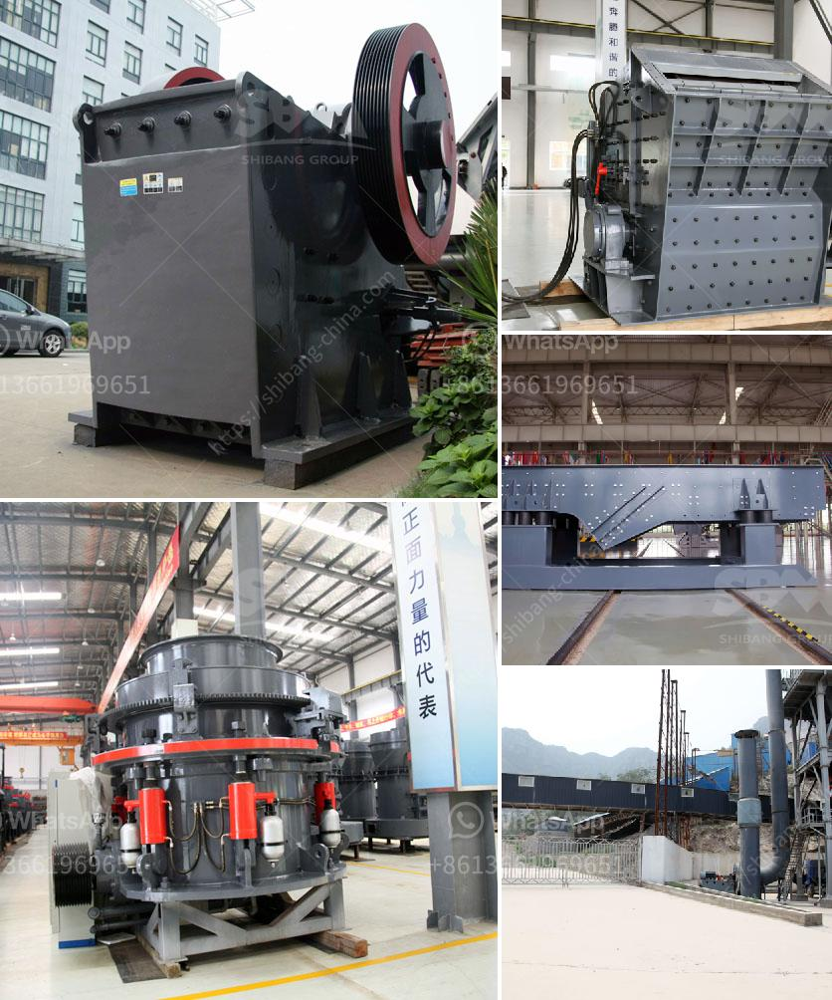

<h3>used coal washing plants for sale in india</h3>
Coal washing is an indispensable process for deep processing of coal. Coal preparation plant also named coal wash plant. The coal directly mined from the mine is called raw coal. The raw coal is mixed with many impurities during the mining process, and the quality of the coal is different. The coal with small internal ash and large internal ash is mixed. together. Coal washing is an industrial process in which impurities in raw coal are removed or high-quality coal and inferior coal are classified.

Coal washing plants for sale in India are in high demand. Coal generally has a volumetric energy density of around 24 MJ/kg, possessing a carbon content in the range of 70 to 85 percent. Ethical perspectives on mining are becoming increasingly prominent, with calls for responsible mining and land rehabilitation gaining traction. Coal washing plants factor into improving the quality of coal and reducing its negative environmental impact.

Water is a crucial element in the coal washing process. The amount of water required is dependent on the quality of coal and the type of washing plant employed. The common coal washing plants include a dense media separation (DMS) plant, which is specifically used in the washing process of coal separators or centrifuges, and a froth flotation plant, which operates around the principles of hydrophobicity to achieve separation.

The availability of used coal washing plants in India provides an opportunity for economical and sustainable growth. While rejecting coal impurities, the plants conserve water, and reduce pollution. Moreover, the plants are environment-friendly as they reduce the emission of harmful pollutants. Utilizing used coal washing plants clearly aligns with the emerging global focus on sustainable development and responsible mining practices.

India is one of the largest consumers of coal worldwide, with its coal mining and thermal power generation industries contributing significantly to both national energy security and the country's economic growth. However, the coal industry faces challenges related to the increasing costs of extracting coal from more remote locations and a greater focus on environmental sustainability. Acquiring used coal washing plants can alleviate some of these challenges by enabling improved coal quality and cost efficiencies.

The market for used coal washing plants in India is growing exponentially, especially as coal-dependent industries such as power plants and steelmaking continue to thrive and expand. Buying refurbished or second-hand coal washing plants is an affordable option for coal operators and coal contractors in India. It helps preserve the environment as well as the life-span of the machinery, while maximizing resource recovery and return on investment.

In conclusion, a used coal washing plant is a reliable solution in coal industries requiring the continuous flow of higher-quality coal. Coal preparation plants employ various processes and technologies to improve coal quality and remove impurities, depending on the requirement of the end-users. The market for used coal washing plants in India is robust and well-positioned for future growth. By acquiring used coal washing plants, entrepreneurs, and coal operators can benefit from cost and operational savings, while also contributing to a more sustainable and responsible coal industry.
<h3>Contact us</h3><ul><li><strong>Whatsapp:&nbsp;<a href="https://wa.me/8613661969651">+8613661969651</a></strong></li><li><a href="https://swt.shibang-china.com/?git&amp;zhl&amp;used coal washing plants for sale in india"><strong>Online Service(chat now)</strong></a></li></ul><h3>Related</h3><ul><li><a href='grinding steel balls for mining.md'>grinding steel balls for mining</a></li><li><a href='marble granite stone grinding machine price.md'>marble granite stone grinding machine price</a></li><li><a href='conveyor belting manufacturers.md'>conveyor belting manufacturers</a></li><li><a href='sand mills for manufacturing.md'>sand mills for manufacturing</a></li><li><a href='how much is the price of a jaw crusher.md'>how much is the price of a jaw crusher</a></li></ul>