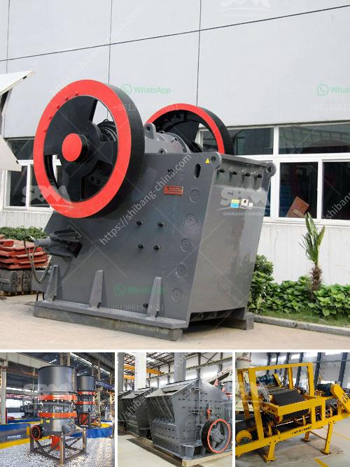

<h3>used concrete crusher manufacturer in malaysia</h3>
As we all know, the concrete is the basic raw material for building industry. With the development of economy, the concrete has made great strides in recent years. As a result, the concrete industries have developed rapidly. Concrete crushers are becoming more and more popular.

Typically, concrete crushers are used to recycle waste concrete or to crush and grind old concrete into small particles for aggregate production. In Malaysia, concrete crushing equipment is widely used in crushing all kinds of ores and massive stones into required size.

With the development of infrastructure in Malaysia, the concrete industry is flourishing. Among the many concrete crusher manufacturers in the market, Shanghai SBM is a professional manufacturer and supplier of mining machines in the world, especially in Malaysia. Shanghai SBM has been committed to producing high-quality mining machines for decades.

As the earliest concrete crusher manufacturer and supplier, Shanghai SBM has decades of experience in designing and manufacturing concrete crushers. During the past few decades, SBM has been always trying its best to produce high-quality concrete crusher to meet the market demand.

The concrete crusher produced by SBM has successfully been used in many concrete recycling projects in Malaysia. In addition, the concrete crusher can crush large-scale materials with low investment costs, large crushing ratio, reliable operation, and easy transportation. These advantages have been widely applied in the removal of old concrete structures, reclaiming land for new construction, and recycling waste concrete.

Shanghai SBM is a leading manufacturer of crushing and screening equipment, and owns a modern production base of 50,000 square meters. In addition, they also have advanced processing equipment and technologies, providing customers with more reliable and high-quality equipment. All the products are CE certified, meeting international standards of quality and performance.

SBM's concrete crushers have been exported to more than 20 countries and regions in the world, including Malaysia, India, Indonesia, and other Southeast Asian countries. SBM has won a good reputation among customers worldwide due to its perfect service and excellent product quality.

The used concrete crusher manufacturer in Malaysia provided by SBM is welcomed by the local customers for its outstanding performance and low operating costs. Many customers have reported that the concrete crusher can provide cost-effective crushing solutions for them. SBM has always been the leading role in concrete recycling industry.

In conclusion, concrete crushers have become an essential part of construction industry in Malaysia, and SBM is a well-known used concrete crusher manufacturer in Malaysia, regarding the concrete crushing equipment produced by SBM, its quality is reliable and the price is reasonable. If you have any demand, do not hesitate to contact us!
<h3>Contact us</h3><ul><li><strong>Whatsapp:&nbsp;<a href="https://wa.me/8613661969651">+8613661969651</a></strong></li><li><a href="https://swt.shibang-china.com/?git&amp;zhl&amp;used concrete crusher manufacturer in malaysia"><strong>Online Service(chat now)</strong></a></li></ul><h3>Related</h3><ul><li><a href='quarry crusher equipment manufacturer in germany.md'>quarry crusher equipment manufacturer in germany</a></li><li><a href='gypsum processing crusher.md'>gypsum processing crusher</a></li><li><a href='portable silica sand washing machine.md'>portable silica sand washing machine</a></li><li><a href='india crushers association.md'>india crushers association</a></li><li><a href='calcium carbide production machinery.md'>calcium carbide production machinery</a></li></ul>