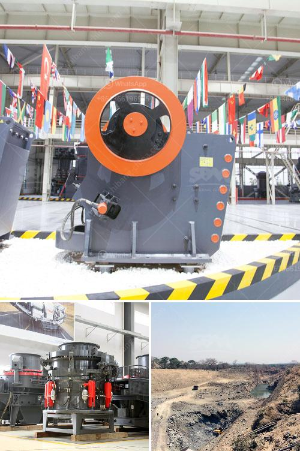

<h3>used conical crushers for sale</h3>
Crushing is an essential process in industries such as mining, aggregate, and construction. However, acquiring new crushers can be expensive, especially for small to medium-sized businesses. Fortunately, there is an alternative - used conical crushers for sale. These machines offer a cost-effective solution for entrepreneurs and industry professionals seeking efficient, reliable, and affordable crushing equipment.

Conical crushers, also known as cone crushers, are widely used in the industry due to their ability to crush a variety of materials with high efficiency. This type of crusher consists of a curved cone-shaped crushing chamber, inclined at an angle to the horizontal. As the cone rotates, the rocks are crushed between the mantle and concave.

When considering used conical crushers, it is essential to understand their advantages and key features. Firstly, these crushers can handle a wide range of materials, from hard to soft, and from abrasive to non-abrasive. This versatility makes them suitable for various applications, such as crushing ores, aggregates, and even recycled materials.

Secondly, the conical shape of the crushing chamber ensures a consistent reduction in size throughout the entire crushing process. This results in a well-graded product with a uniform particle size distribution, which is crucial for many industries.

Moreover, used conical crushers often come with additional features that enhance their performance and productivity. For example, some models are equipped with hydraulic systems to adjust the crusher's closed side setting, allowing for precise control over the final product size. Others may have conveyor belts or vibrating screens integrated into their design, simplifying the production process.

There are several factors to consider when searching for used conical crushers for sale. First and foremost, it is crucial to determine the requirements of your specific application. This includes factors such as the material to be crushed, required capacity, and desired final product size. By understanding your needs, you can focus your search on models that meet your specific criteria.

Additionally, it is vital to inspect the physical condition of the used crusher. This includes examining the wear parts, such as the mantle and concave, as well as the overall structure of the machine. Reputable sellers should provide detailed information about the crusher's history, maintenance records, and any repairs or upgrades that have been done.

Finding a reliable seller or dealer is equally important when purchasing a used conical crusher. Established dealers often have a wide selection of models to choose from, as well as the expertise to answer any questions you may have. It is also recommended to inquire about any warranties or service agreements offered by the seller to protect your investment.

In conclusion, used conical crushers offer a cost-effective solution for businesses seeking crushing equipment. Their versatility, efficiency, and affordability make them a viable option for various applications. However, it is essential to consider your specific requirements, inspect the crusher's condition, and purchase from a reputable seller. By doing so, you can acquire a reliable and affordable crushing solution that meets your needs.
<h3>Contact us</h3><ul><li><strong>Whatsapp:&nbsp;<a href="https://wa.me/8613661969651">+8613661969651</a></strong></li><li><a href="https://swt.shibang-china.com/?git&amp;zhl&amp;used conical crushers for sale"><strong>Online Service(chat now)</strong></a></li></ul><h3>Related</h3><ul><li><a href='limestone grinding raymond mill.md'>limestone grinding raymond mill</a></li><li><a href='corncob crusher machine.md'>corncob crusher machine</a></li><li><a href='ball mill plant manufacturers.md'>ball mill plant manufacturers</a></li><li><a href='harga pasaran stone crusher.md'>harga pasaran stone crusher</a></li><li><a href='quarry crusher plant.md'>quarry crusher plant</a></li></ul>