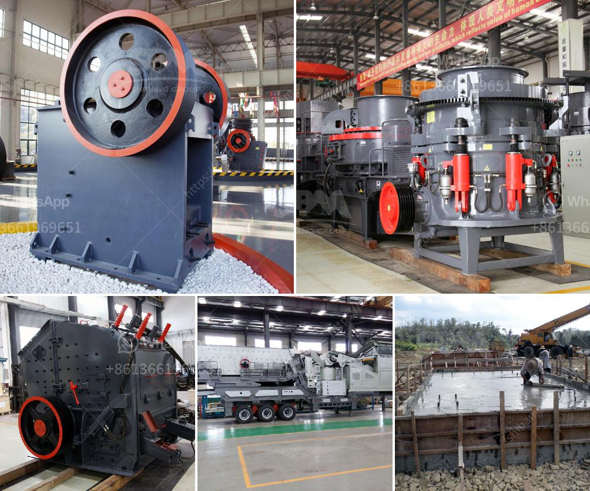

<h3>used conveyor belt for sale saudi arabia</h3>
Conveyor belts are commonly used in the transportation and packaging industries, among others. Nowadays, buying a used conveyor belt is a common practice in Saudi Arabia. It comes with a host of benefits considering the cost saving and environmental factors. However, who sells such belts in Saudi Arabia? These used conveyor belts are acquired directly from reputable and relevant suppliers in the market, ensuring maximum reliability and durability.

One of the longest-running businesses that deal with used conveyor belts in Saudi Arabia is Tenau Elevator (Saudi Arabia) Co. Ltd. Established in 2002, they have been supplying conveyor belts to the Saudi market, offering an extensive range of products. These belts are known for their excellent quality and versatility, making them suitable for various industries and applications.

The used conveyor belts offered by Tenau Elevator are sourced from reliable providers worldwide. They undergo a rigorous inspection process to ensure their quality and performance before being made available for sale. These belts are carefully tested for strength, flexibility, and resistance, ensuring that they can handle heavy loads, operate smoothly, and last for a long time.

The use of used conveyor belts in Saudi Arabia brings many advantages to businesses and the environment. First and foremost, it significantly reduces costs compared to buying new belts. This cost-saving option can be highly beneficial for small to medium-sized businesses, allowing them to allocate their resources more efficiently. Moreover, with the same quality and performance as new belts, buying used conveyor belts is a smart investment that can bring long-term financial benefits.

Another advantage is the positive impact on the environment. By opting for used conveyor belts, businesses contribute to reducing waste and conserving natural resources. By extending the lifespan of these belts and preventing them from being discarded prematurely, companies actively participate in sustainable practices. This aligns with the global movement focused on reducing waste and promoting a circular economy.

In addition to being cost-effective and environmentally friendly, used conveyor belts also offer versatility and reliability. They can be used in a wide range of applications, such as manufacturing, mining, food processing, and transportation. These belts can handle different materials, including bulk products, packaged goods, and even heavy-duty items. As a result, businesses can optimize their operations, improving productivity and efficiency.

Purchasing used conveyor belts in Saudi Arabia is a great choice for businesses looking to expand and enhance their operations. They provide a cost-effective solution while minimizing their environmental footprint. Tenau Elevator (Saudi Arabia) Co. Ltd. has a strong reputation for supplying high-quality used conveyor belts, ensuring reliable and durable performance. With their extensive range of products, businesses can find the perfect belt for their specific needs and industry requirements.

Overall, the availability of used conveyor belts for sale in Saudi Arabia represents a valuable opportunity for businesses to enhance their operations while making a positive impact on the environment. By choosing reputable suppliers, like Tenau Elevator, businesses can acquire durable and reliable belts that meet their requirements, ensuring long-term success and profitability.
<h3>Contact us</h3><ul><li><strong>Whatsapp:&nbsp;<a href="https://wa.me/8613661969651">+8613661969651</a></strong></li><li><a href="https://swt.shibang-china.com/?git&amp;zhl&amp;used conveyor belt for sale saudi arabia"><strong>Online Service(chat now)</strong></a></li></ul><h3>Related</h3><ul><li><a href='feldspar grinding machine.md'>feldspar grinding machine</a></li><li><a href='sand washing plant in turkey.md'>sand washing plant in turkey</a></li><li><a href='gypsum powder machine.md'>gypsum powder machine</a></li><li><a href='selling cone crusher made in china.md'>selling cone crusher made in china</a></li><li><a href='crusher 300 sampai 400 ton dan hr dijual.md'>crusher 300 sampai 400 ton dan hr dijual</a></li></ul>