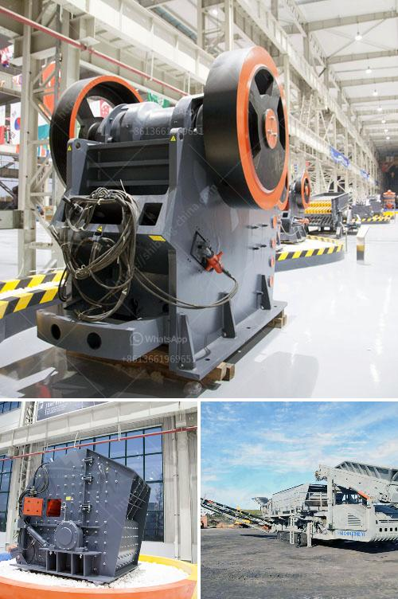

<h3>used crushers in germany for sale</h3>
Germany is known for its robust engineering and high-quality manufacturing processes. When it comes to industrial machinery, the country has a stellar reputation around the world. The used crusher market in Germany is no exception. There is a wide range of crushers available, from jaw crushers and impact crushers to cone crushers and VSI crushers. These machines are highly efficient and offer reliable performance.

Investing in a used crusher can be a smart choice for businesses looking to expand their operations or replace outdated equipment. The key advantage of purchasing a used crusher in Germany is the significant cost savings. Used crushers are often available at a fraction of the cost of new ones, while still offering the same level of performance and reliability.

One of the leading online platforms for buying and selling used crushers in Germany is Machinery Trader. Here, you can find a wide selection of used crushers from reputable sellers across the country. Whether you're looking for a primary crusher for mining operations or a secondary crusher for construction projects, you can find it all on Machinery Trader.

The used crusher market in Germany offers a variety of options for different industries and applications. For example, jaw crushers are ideal for primary crushing in quarries and recycling plants, while cone crushers are commonly used for secondary and tertiary crushing in mining and construction. Impact crushers, on the other hand, are perfect for producing high-quality agregates for road construction and concrete production.

When buying a used crusher, it's important to consider factors such as the machine's condition, service history, and the reputation of the seller. Machinery Trader ensures that all sellers on their platform are vetted and meet strict quality standards. Additionally, they provide detailed information about each crusher, including specifications, photos, and pricing, making it easier for buyers to make informed decisions.

In conclusion, the used crusher market in Germany offers businesses an opportunity to acquire high-quality machinery at affordable prices. Whether you're in the mining, construction, or recycling industry, there is a used crusher out there that can meet your needs. Start browsing the wide selection of used crushers on Machinery Trader and take advantage of the cost savings today.
<h3>Contact us</h3><ul><li><strong>Whatsapp:&nbsp;<a href="https://wa.me/8613661969651">+8613661969651</a></strong></li><li><a href="https://swt.shibang-china.com/?git&amp;zhl&amp;used crushers in germany for sale"><strong>Online Service(chat now)</strong></a></li></ul><h3>Related</h3><ul><li><a href='vibrating screen for sale philippines.md'>vibrating screen for sale philippines</a></li><li><a href='limestone crusher cost.md'>limestone crusher cost</a></li><li><a href='quartz stone powder machine manufacturing in india.md'>quartz stone powder machine manufacturing in india</a></li><li><a href='second hand gypsum powder line.md'>second hand gypsum powder line</a></li><li><a href='copper crusher manufacturer in turkey.md'>copper crusher manufacturer in turkey</a></li></ul>