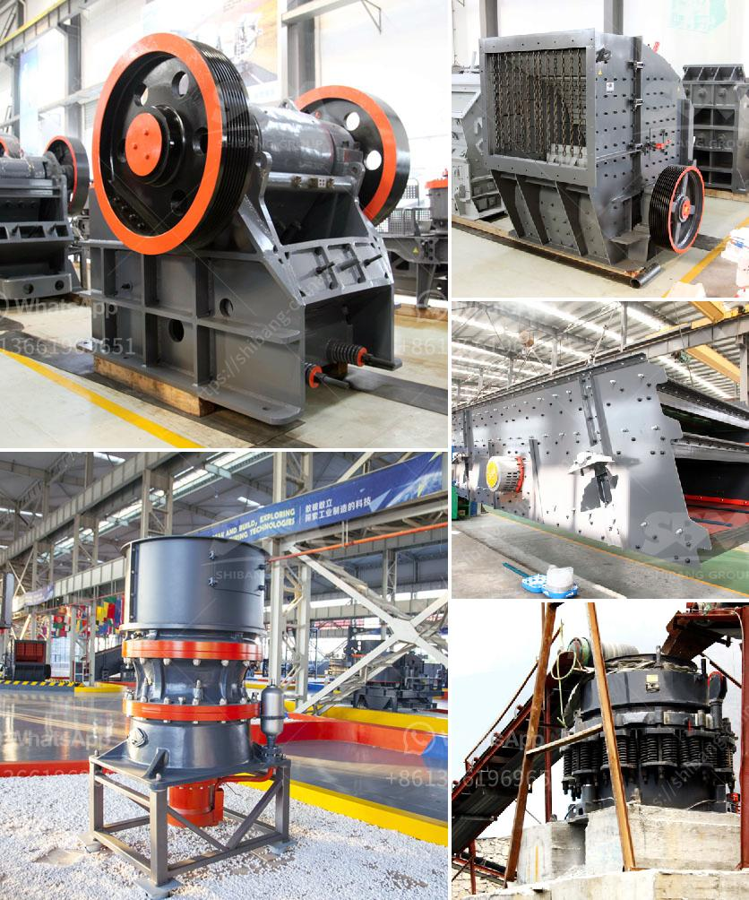

<h3>used crushing plants for sale in uae</h3>
The UAE considered as a global trading hub is known for its flourishing trade activities and extensive infrastructure development. The construction sector in the UAE continues to witness substantial growth due to the high demand for residential and commercial projects. As a result, the demand for aggregate materials such as crushed stones, gravel, and sand for construction purposes is constantly increasing. This surge in demand has led to a rise in the availability of used crushing plants for sale in the UAE.

Used crushing plants offer an economical and sustainable solution for faster and efficient construction operations. These plants are cost-effective alternatives to purchasing new crushing equipment. With advances in technology, used crushing plants are often in excellent condition and can generate the same output as a new plant. Moreover, the availability of used crushing plants in the market enables businesses to have access to a wider range of options and models that suit their specific requirements.

One of the key advantages of purchasing used crushing plants is the significant cost savings. Investing in a used plant can offer substantial financial benefits as they come at a fraction of the price compared to buying a new one. This makes it an attractive option for businesses, especially small and medium-scale construction companies, that have budget limitations but require high-quality crushing equipment to meet their production targets.

Additionally, the resale value of used crushing plants is relatively higher, allowing businesses to recover a considerable portion of their investment when they decide to upgrade or replace their equipment. This makes used crushing plants a lucrative investment with the potential for profitable returns.

Another advantage of opting for used crushing plants is their reduced environmental impact. The process of manufacturing new plants requires the extraction and processing of raw materials, which can contribute to resource depletion and environmental degradation. By choosing used crushing plants, businesses promote sustainable practices by reducing the demand for new equipment and minimizing the carbon footprint associated with its production.

Furthermore, purchasing used crushing plants enables businesses to quickly adapt to changing market conditions and project requirements. As the UAE construction industry experiences frequent fluctuations, having the flexibility to acquire specific types of crushing plants as per the project demand proves to be essential. The availability of a wide range of used crushing plants for sale ensures that businesses can choose the most suitable one that aligns with the scope and scale of their projects.

In conclusion, used crushing plants provide an economic and sustainable solution for businesses in the UAE construction industry. These plants offer cost savings, high-quality equipment, and environmental benefits. By opting for used crushing plants, businesses can maximize their investments while contributing to the overall sustainable development of the construction sector in the UAE.
<h3>Contact us</h3><ul><li><strong>Whatsapp:&nbsp;<a href="https://wa.me/8613661969651">+8613661969651</a></strong></li><li><a href="https://swt.shibang-china.com/?git&amp;zhl&amp;used crushing plants for sale in uae"><strong>Online Service(chat now)</strong></a></li></ul><h3>Related</h3><ul><li><a href='new trends in concrete technology slide presentation.md'>new trends in concrete technology slide presentation</a></li><li><a href='stone crusher made in italy.md'>stone crusher made in italy</a></li><li><a href='china roller mill kenya.md'>china roller mill kenya</a></li><li><a href='china ball mill supplier.md'>china ball mill supplier</a></li><li><a href='bentonite clay processing production line supplier.md'>bentonite clay processing production line supplier</a></li></ul>