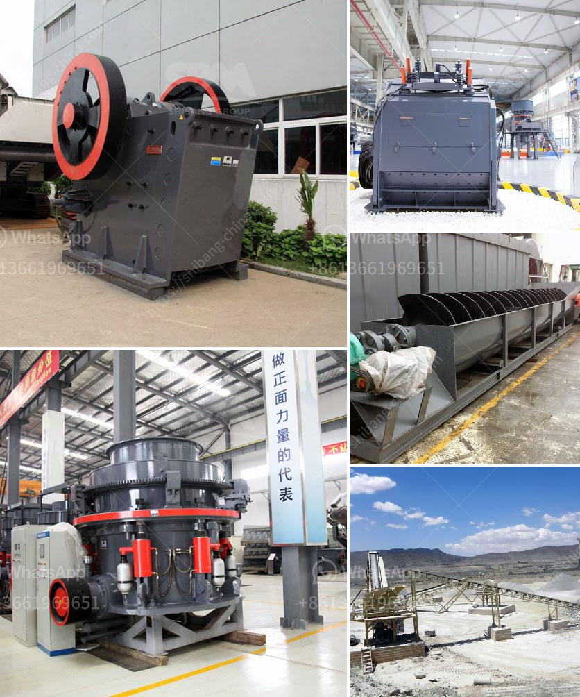

<h3>used gold ore processing equipment for sale</h3>
Gold ore processing as we all know has played a vital role in modern industry. Throughout the centuries, gold has been recovered from its ores in many ways. These range from the rocker or long tom of the California Forty-Niner and the noisy stamp mill of the 19th century to modern methods of leaching with cyanide, electrolysis and recovery techniques using carbon adsorption. With the development of technology and the increase in demand for gold, gold ore processing equipment has become more and more popular on the market.

Used gold ore processing equipment for sale mainly includes crushing equipment, grinding equipment, and beneficiation equipment. Each category of equipment has its own specific characteristics and functions.

Firstly, the crushing equipment includes jaw crusher, cone crusher, impact crusher, and mobile crusher. These types of crushers are designed to crush various types of gold ore efficiently. Jaw crusher and cone crusher are the common machines used in crushing plants. They are widely used in coarse crushing of hard rock materials. Impact crusher is mainly used for medium-sized and fine crushing operations. It can crush materials with compressive strength not exceeding 350 MPa, such as granite, limestone, concrete, etc. Mobile crusher is a new type of crushing equipment, which is convenient to move and flexible to operate. It has the advantages of strong mobility, high efficiency, and energy saving.

Secondly, the grinding equipment includes ball mill, vertical mill, Raymond mill, and ultrafine mill. These types of mills are widely used in gold ore grinding operations. Ball mill is the key equipment for grinding after the crushing process, which is widely used in the manufacture industries, such as cement, silicate, new building material, refractory material, fertilizer, ferrous metal, nonferrous metal, and glass ceramics. Vertical mill, Raymond mill, and ultrafine mill are all ideal grinding equipment for gold ore processing.

Lastly, the beneficiation equipment includes shaking table, spiral classifier, and flotation machine. These equipment are used to separate and concentrate gold from gold-bearing ores. Shaking table is one of the main equipment for gravity concentration. It is widely used in the separation of gold, silver, tungsten, tin, tantalum, niobium, and other rare metals and precious metals. Spiral classifier is used to separate the ore mixture in the ore pulp. It is suitable for grading the size of ore particles before flotation separation. Flotation machine is the key equipment for flotation separation. It is widely used in flotation operations of copper, lead, zinc, nickel, molybdenum, gold, etc.

In conclusion, used gold ore processing equipment for sale has the advantages of high production efficiency, low operating cost, reliable operation, easy maintenance, and high return on investment. It is the best choice for small-scale gold processing operations. If you are interested in gold ore processing equipment, you can consult with professional manufacturers or suppliers to find the suitable equipment for your production needs.
<h3>Contact us</h3><ul><li><strong>Whatsapp:&nbsp;<a href="https://wa.me/8613661969651">+8613661969651</a></strong></li><li><a href="https://swt.shibang-china.com/?git&amp;zhl&amp;used gold ore processing equipment for sale"><strong>Online Service(chat now)</strong></a></li></ul><h3>Related</h3><ul><li><a href='gypsum factory in ethiopia.md'>gypsum factory in ethiopia</a></li><li><a href='stone crushing business in pakistan.md'>stone crushing business in pakistan</a></li><li><a href='cost of starting a quarry business.md'>cost of starting a quarry business</a></li><li><a href='sell jaw crusher the dubia.md'>sell jaw crusher the dubia</a></li><li><a href='gold wash plant turkey manufacturer.md'>gold wash plant turkey manufacturer</a></li></ul>