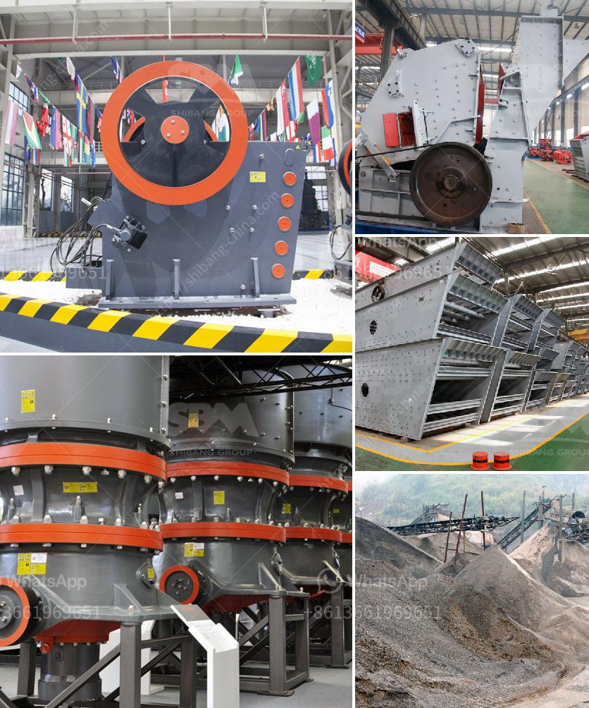

<h3>used hammer mill for sale</h3>
Looking to buy a used hammer mill? Look no further! A used hammer mill can be a great investment for those looking to save money or for businesses that may need to add a hammer mill to their existing machinery. Whatever your needs, buying a used hammer mill can be an affordable option that will get the job done without breaking the bank.

A hammer mill is a versatile machine that can be used for a variety of purposes. From shredding scrap metal to grinding grains and even producing biofuel, hammer mills are a proven and reliable piece of equipment. As with any machinery purchase, it's important to buy from a reputable seller. Look for a seller who specializes in used hammer mills and who has a reputation for selling quality equipment.

One of the main advantages of buying a used hammer mill is the potential savings. Depending on the condition of the machine, a used hammer mill can cost significantly less than a new one. This can be especially appealing for small businesses or those on a tight budget. It's important to note that while used equipment may have some wear and tear, it can still function efficiently. If possible, try to inspect the machine before purchasing or ask the seller for detailed information about its condition.

Additionally, buying used equipment can contribute to sustainability efforts. By giving a previously-owned hammer mill new life, you are reducing waste and minimizing the need for new manufacturing. This can be seen as a win-win situation, as you save money while also reducing your environmental impact.

In conclusion, buying a used hammer mill can be a smart choice for those in need of this type of equipment. With potential savings and a positive impact on the environment, it's a win-win situation for both your budget and sustainability goals. So why wait? Start exploring your options and find a used hammer mill for sale that meets your needs today!
<h3>Contact us</h3><ul><li><strong>Whatsapp:&nbsp;<a href="https://wa.me/8613661969651">+8613661969651</a></strong></li><li><a href="https://swt.shibang-china.com/?git&amp;zhl&amp;used hammer mill for sale"><strong>Online Service(chat now)</strong></a></li></ul><h3>Related</h3><ul><li><a href='copper ore machine in china.md'>copper ore machine in china</a></li><li><a href='manufacturers of conveyor belts.md'>manufacturers of conveyor belts</a></li><li><a href='roller mill for muradabad.md'>roller mill for muradabad</a></li><li><a href='model ball mill.md'>model ball mill</a></li><li><a href='philippines crusher manufacturers in pakistan.md'>philippines crusher manufacturers in pakistan</a></li></ul>