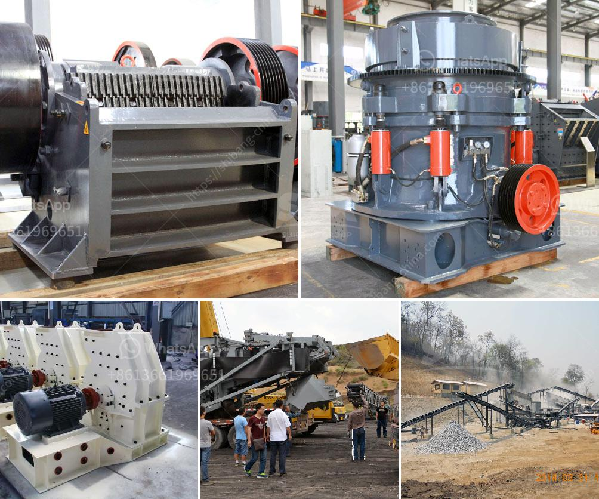

<h3>used iron ore jaw crusher price nigeria</h3>
Iron ore is one of the abundant mineral resources in Nigeria, which plays a great role in the country's development. According to geological surveys conducted by the Nigerian Geological Survey Agency, Nigeria has substantial deposits of iron ore, making the nation one of the top exporters of the resource in Africa. However, despite this potential, the mining and production of iron ore in Nigeria face several challenges, including inadequate infrastructure and machinery.

One key piece of machinery used in the mining of iron ore is the jaw crusher, a machine designed to reduce large rocks into smaller rocks, gravel, or rock dust. The jaw crusher is commonly used in the mining of iron ore because it is of simple structure, reliable performance, and easy maintenance. It is widely used in crushing various ores and bulk materials, such as mining, smelting, building materials, highways, railways, water conservancy, and chemical industries.

When it comes to the price of a used iron ore jaw crusher in Nigeria, there are factors that influence it. First and foremost is the quality and performance of the machine. A jaw crusher with high-quality materials and advanced manufacturing processes can effectively reduce maintenance costs and achieve longer service life. Additionally, the brand reputation of the manufacturer also affects the price, as established and reputable brands often charge a premium for their products due to their track record of producing reliable and durable machinery.

Another factor that affects the price of a used iron ore jaw crusher in Nigeria is the economic situation in the country. Whether the economy is booming or in recession can have a significant impact on the demand and supply of iron ore. During a recession, the demand for iron ore might decrease, leading to a decrease in the price of crushers that are used in the mining and production of the resource as a result of reduced demand.

Furthermore, the availability and cost of spare parts are crucial considerations when determining the price of a used iron ore jaw crusher. The durability and longevity of the machine heavily depend on the availability of genuine spare parts and the ease of finding them. A machine with readily available spare parts will have a higher price compared to one where spare parts are scarce or expensive to find.

In conclusion, the price of a used iron ore jaw crusher in Nigeria is influenced by various factors: the quality and performance of the machine, the reputation of the manufacturer, the economic situation, and the availability and cost of spare parts. It is important for potential buyers to consider these factors and conduct thorough research before making a purchase decision. Investing in a high-quality jaw crusher can greatly enhance the efficiency and productivity of iron ore mining operations, leading to increased profitability for mining companies and the overall development of Nigeria's mining sector.
<h3>Contact us</h3><ul><li><strong>Whatsapp:&nbsp;<a href="https://wa.me/8613661969651">+8613661969651</a></strong></li><li><a href="https://swt.shibang-china.com/?git&amp;zhl&amp;used iron ore jaw crusher price nigeria"><strong>Online Service(chat now)</strong></a></li></ul><h3>Related</h3><ul><li><a href='stone crushing process.md'>stone crushing process</a></li><li><a href='horizontal grinding mills price.md'>horizontal grinding mills price</a></li><li><a href='ball mill ghana in zambia.md'>ball mill ghana in zambia</a></li><li><a href='china manufacturers of sand washing machine.md'>china manufacturers of sand washing machine</a></li><li><a href='stone crusher discount.md'>stone crusher discount</a></li></ul>