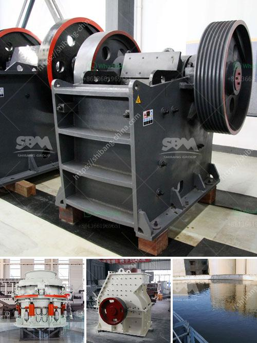

<h3>used mining equipment for sale in ghana</h3>
Ghana is blessed with a plethora of mineral resources, such as gold, diamond, manganese, bauxite, and oil, among others. The mining industry in Ghana has seen tremendous growth and development over the years, contributing significantly to the country's economic progress. Mining operations require the utilization of various equipment, and as mining activities grow, the demand for mining equipment also increases. This is where the availability of used mining equipment for sale in Ghana becomes an attractive option for many mining companies.

Used mining equipment provides an affordable alternative to buying new equipment without compromising quality, performance, and efficiency. These machines have already proven their effectiveness in the industry, making them a reliable choice for those looking to set up or expand their mining operations. Both small-scale and large-scale mining companies can benefit from purchasing used mining equipment in Ghana.

One of the significant advantages of buying used mining equipment is cost savings. Acquiring brand-new equipment can be capital intensive, especially for small-scale miners or those experiencing financial constraints. Opting for used equipment allows miners to access high-quality machines at more affordable prices. Additionally, the resale value of used mining equipment tends to be higher compared to other industrial machinery, making it a viable investment option.

Another advantage of used mining equipment is reduced lead time. When purchasing new equipment, there is often a waiting period for production and delivery, since manufacturers may have a backlog of orders. On the other hand, used mining equipment is readily available, allowing mining companies to commence operations without unnecessary delays. This swift access to machinery can help maximize productivity and minimize downtime.

Furthermore, used mining equipment has already been tested and proven to perform well in mining environments. They have undergone rigorous standards and safety checks to ensure their reliability and efficiency. By purchasing used equipment, miners can skip the trial-and-error process often associated with new machinery. This results in reduced risks and increased productivity, ultimately translating into higher profits.

However, it is vital to exercise caution when purchasing used mining equipment. It is essential to conduct a thorough evaluation and inspection of the machinery to ensure its condition and functionality. This includes checking the maintenance history, hours of operation, and overall wear and tear. Consulting with industry experts or hiring an independent inspector can provide valuable insights into the equipment's quality.

Several avenues exist to source used mining equipment for sale in Ghana. Online marketplaces, such as mining equipment auction platforms and classified websites, offer a wide range of options. Additionally, contacting local mining associations, industry publications, or attending mining trade shows can provide leads on available used equipment. Working closely with reputable dealers and brokers in the mining sector can also help connect buyers with reliable sellers.

In conclusion, the availability of used mining equipment for sale in Ghana offers a practical and cost-effective option for mining companies. By opting for pre-owned machinery, miners can save on upfront costs, reduce lead time, mitigate risk, and maximize productivity. However, it is crucial to approach the process diligently by evaluating the equipment's condition to ensure a wise investment. As Ghana continues to develop its mining industry, the demand for used mining equipment will likely remain strong.
<h3>Contact us</h3><ul><li><strong>Whatsapp:&nbsp;<a href="https://wa.me/8613661969651">+8613661969651</a></strong></li><li><a href="https://swt.shibang-china.com/?git&amp;zhl&amp;used mining equipment for sale in ghana"><strong>Online Service(chat now)</strong></a></li></ul><h3>Related</h3><ul><li><a href='iron ore crusher for sale.md'>iron ore crusher for sale</a></li><li><a href='stone crusher dubai.md'>stone crusher dubai</a></li><li><a href='crusher manufacturer in gujarat.md'>crusher manufacturer in gujarat</a></li><li><a href='project plan about stone crashing machine.md'>project plan about stone crashing machine</a></li><li><a href='stamp mill for sale in south africa.md'>stamp mill for sale in south africa</a></li></ul>