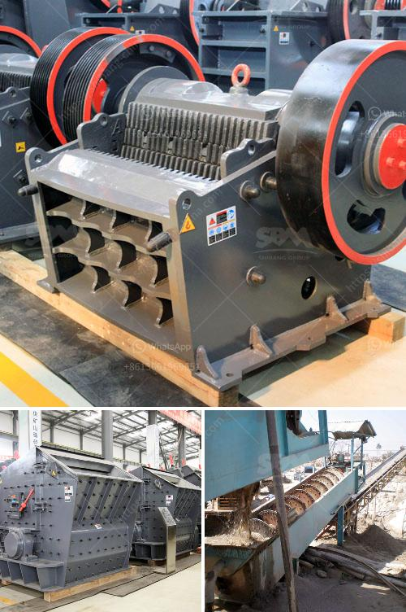

<h3>used raymond grinding mill sale offer in pakistan</h3>
Raymond grinding mill is widely used in the powder processing of various minerals, such as limestone, quartz, coal, clay, kaolin, coke, bentonite, feldspar, shale, etc. It is suitable for processing various non-flammable and non-explosive materials with Mohs hardness up to 9.3 and humidity below 6%.

The used Raymond grinding mill sale offer in Pakistan provides the most competitive price without any decrease in quality. Working with efficient and high-quality grinding mills is a critical factor in achieving profitable outcomes. Grinding mills are used in the cement industry to grind clinker, in the mining industry for grinding minerals such as coal, gold, copper, iron ore, and others, and in the chemical industry for grinding raw materials and finished products.

One of the key advantages of purchasing a used Raymond grinding mill is its low initial cost. Used grinding mills are often more affordable than new ones, making them an attractive option for businesses on a tight budget or those looking to expand their production capacity without investing heavily in new equipment.

Furthermore, used grinding mills can be obtained quickly, reducing the downtime associated with waiting for new machinery to be manufactured and delivered. This is particularly advantageous for businesses with urgent production needs or those operating in regions where delivery times are lengthy.

Used Raymond grinding mill sale in Pakistan also offers significant environmental benefits. By recycling pre-owned equipment, we can minimize the energy consumption and emissions associated with manufacturing new machinery. This is a positive step towards sustainability and reducing the carbon footprint of industries utilizing grinding mills.

When considering a used Raymond grinding mill, it is important to choose a reputable seller or dealer. Opting for a trusted supplier ensures that the equipment has been properly inspected, refurbished if necessary, and is in good working condition. This helps to minimize the risk of unexpected breakdowns or costly repairs that could impact production.

In addition to the purchase price, buyers should also consider the ongoing maintenance and support offered by the seller. It is essential to choose a supplier that can provide timely customer support, spare parts, and technical expertise. This ensures that any issues or concerns can be addressed promptly, minimizing any potential production disruptions.

Used Raymond grinding mill sale offers in Pakistan are not limited to large-scale industrial applications. Smaller-scale grinding mills are also available for home and individual use. This opens up opportunities for businesses and individuals looking to venture into the grinding mill industry.

Grinding mills are an essential tool for many industries and provide crucial support in the processing of various materials. Whether for industrial-scale operations or smaller-scale applications, a used Raymond grinding mill sale in Pakistan can offer a cost-effective solution with proven performance and efficient operation.

In summary, purchasing a used Raymond grinding mill from a reliable supplier offers numerous advantages, including cost savings, fast delivery, reduced environmental impact, and ongoing customer support. Regardless of the intended application, grinding mills play a vital role in industries worldwide, and a used grinding mill can provide an excellent investment opportunity.
<h3>Contact us</h3><ul><li><strong>Whatsapp:&nbsp;<a href="https://wa.me/8613661969651">+8613661969651</a></strong></li><li><a href="https://swt.shibang-china.com/?git&amp;zhl&amp;used raymond grinding mill sale offer in pakistan"><strong>Online Service(chat now)</strong></a></li></ul><h3>Related</h3><ul><li><a href='want to lease diamond mining equipment in south africa.md'>want to lease diamond mining equipment in south africa</a></li><li><a href='crushing and screening simulation software.md'>crushing and screening simulation software</a></li><li><a href='equipment necessary to exploiting a quarry.md'>equipment necessary to exploiting a quarry</a></li><li><a href='lime stone grinder machine price in india.md'>lime stone grinder machine price in india</a></li><li><a href='100tph stone crusher for rent india.md'>100tph stone crusher for rent india</a></li></ul>