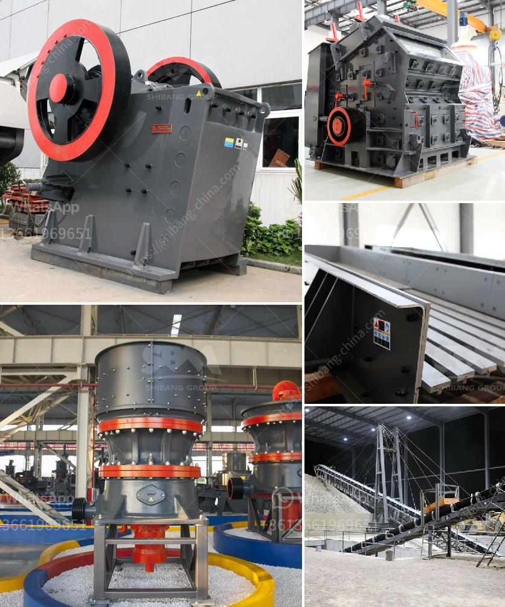

<h3>used rock crushers for sale in germany</h3>
Used rock crushers for sale in Germany have provided the groundwork for Germany's thriving construction industry ever since the Roman era. As the demand for these types of products grew, the processing industry took off and today, Germany is the largest producer of construction materials in Europe.

Rock crushers are an absolute necessity when it comes to breaking down large rocks into smaller pieces. These crushers can be used for a variety of purposes, including road construction, demolition, recycling, and mining applications.

One of the most popular rock crushers in Germany is the Rockster R900 mobile impact crusher. This powerful machine can crush up to 200 tons of hard stone per hour, and is ideal for applications such as recycling, demolition, road construction, or quarrying. It has a compact design and can easily be transported from one site to another.

Another popular choice is the Sandvik QJ341 jaw crusher. This heavy-duty machine can handle the toughest materials, thanks to its powerful jaw and high crushing capacity. It is designed for demanding quarrying, mining, and recycling applications and can crush up to 650 tons of stone per hour.

When purchasing a used rock crusher, it is important to consider several factors. Firstly, the condition of the machine should be assessed. It is recommended to buy from reputable sellers who can provide a detailed history of the equipment and any maintenance records.

Secondly, the type of rock crusher should be taken into account. There are different types of crushers available, depending on the material being processed. For example, cone crushers are ideal for crushing hard and abrasive materials, while impact crushers are more suitable for softer rocks.

Furthermore, the size and capacity of the rock crusher should also be considered. The size of the machine will determine its suitability for different applications and the capacity will determine the amount of material that can be processed within a given timeframe.

Additionally, it is important to consider the cost and availability of spare parts for the chosen rock crusher. It is advisable to choose a machine that has readily available spare parts, as this will reduce downtime and maintenance costs in the long run.

Purchasing a used rock crusher can be a cost-effective solution for businesses, as these machines are often sold at a fraction of the original price. However, it is crucial to thoroughly inspect the machine and ensure it is in good working condition before making a purchase.

In conclusion, used rock crushers for sale in Germany have played a crucial role in the country's construction industry. These versatile machines can crush a variety of materials and are suitable for different applications. When purchasing a used rock crusher, it is important to consider the machine's condition, type, size, capacity, and availability of spare parts. With careful consideration, businesses can find the perfect rock crusher to meet their specific needs.
<h3>Contact us</h3><ul><li><strong>Whatsapp:&nbsp;<a href="https://wa.me/8613661969651">+8613661969651</a></strong></li><li><a href="https://swt.shibang-china.com/?git&amp;zhl&amp;used rock crushers for sale in germany"><strong>Online Service(chat now)</strong></a></li></ul><h3>Related</h3><ul><li><a href='crusher price rock crusher price 8mm.md'>crusher price rock crusher price 8mm</a></li><li><a href='sell of crushing machine in lima.md'>sell of crushing machine in lima</a></li><li><a href='crushing concrete materials rates in pakistan.md'>crushing concrete materials rates in pakistan</a></li><li><a href='how much making limestone powder factory costs.md'>how much making limestone powder factory costs</a></li><li><a href='vertically roller mill pakistan.md'>vertically roller mill pakistan</a></li></ul>