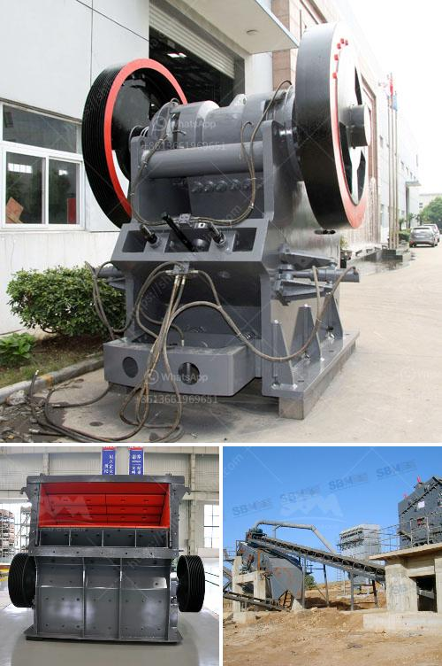

<h3>used rock fine crusher for sale</h3>
Rock crushing is a process used in construction, mining, and aggregate industries. As the name suggests, it involves breaking down large rocks into smaller pieces. Crushers are the primary equipment in this process, and a used rock fine crusher can prove to be a cost-effective solution.

A rock fine crusher is designed to finely crush various types of rocks, maximizing the production of desired end products. These crushers use mechanical force to break down the rocks into smaller sizes, which can then be used for various purposes like road construction, concrete production, or railway ballast.

Investing in a used rock fine crusher can be advantageous for several reasons. Firstly, it significantly reduces the cost of purchasing a brand-new crusher, making it an ideal choice for small to medium-sized businesses with budget constraints. High-quality used crushers can offer the same level of performance and reliability as new ones, at a fraction of the cost.

Secondly, a used rock fine crusher often comes with added benefits, such as spare parts or warranties that are not typically provided with new crushers. This can provide additional peace of mind to buyers, knowing that their investment is protected against potential issues.

Furthermore, used crushers have already undergone wear and tear, which means they have been tested and proven to withstand demanding work conditions. This increases their reliability and reduces the risk of unexpected breakdowns or performance issues.

When shopping for a used rock fine crusher, it is important to consider the specific needs of the business. Factors such as production capacity, power requirements, and ease of maintenance should all be taken into account. Choosing the right crusher can optimize productivity and minimize downtime, leading to increased profitability.

In conclusion, a used rock fine crusher can be an excellent choice for any business involved in rock crushing operations. With reduced costs, added benefits, and proven reliability, it offers a cost-effective solution for breaking down rocks into smaller sizes. Investing in used equipment can provide a competitive advantage to businesses, allowing them to meet their production goals efficiently and economically.
<h3>Contact us</h3><ul><li><strong>Whatsapp:&nbsp;<a href="https://wa.me/8613661969651">+8613661969651</a></strong></li><li><a href="https://swt.shibang-china.com/?git&amp;zhl&amp;used rock fine crusher for sale"><strong>Online Service(chat now)</strong></a></li></ul><h3>Related</h3><ul><li><a href='stone crushing turkey.md'>stone crushing turkey</a></li><li><a href='almond sand stone crusher price.md'>almond sand stone crusher price</a></li><li><a href='feldspar crusher manufacturer.md'>feldspar crusher manufacturer</a></li><li><a href='cement concrete crusher equipment.md'>cement concrete crusher equipment</a></li><li><a href='bentonite powder making.md'>bentonite powder making</a></li></ul>