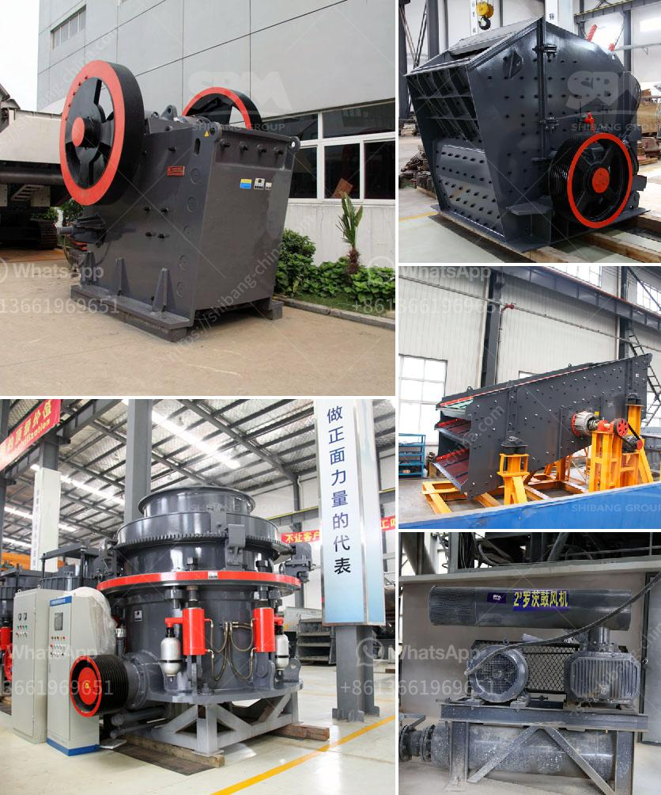

<h3>used sand mobile washing equipment</h3>
Used Sand Mobile Washing Equipment: A Cost-Effective Solution for Efficient Construction Site Operations

Construction sites are often known for being messy and chaotic, with mounds of dirt and debris accumulating over time. The need for clean sand on construction sites is crucial, as it is used for various purposes such as mixing concrete, making mortar, and creating a stable foundation. To ensure a supply of clean sand, construction companies are increasingly turning to used sand mobile washing equipment.

Used sand mobile washing equipment offers a cost-effective solution for construction companies, eliminating the need for manual sand washing. This equipment consists of a portable unit that can be easily transported to different construction sites. It is designed to wash sand and remove impurities, such as clay, silt, and various contaminants, ensuring a high-quality sand supply.

One of the key benefits of used sand mobile washing equipment is its versatility. It can handle a wide range of sand materials, including crushed rock, natural sand, and recycled materials. This flexibility allows construction companies to use different types of sand for various construction projects without the need to invest in multiple units of washing equipment.

Moreover, used sand mobile washing equipment significantly reduces water consumption compared to traditional manual washing methods. It utilizes a closed-loop system that recycles and filters water, minimizing wastage. This is not only environmentally friendly but also contributes to cost savings in terms of water bills.

Efficiency is another advantage that used sand mobile washing equipment offers. These machines are equipped with powerful pumps and high-pressure jets that effectively dislodge and remove dirt, clay, and other contaminants from the sand. The cleaned sand is then discharged through a conveyor belt, ready to be used for construction purposes. This automated process saves time and labor, enabling construction sites to operate more efficiently.

Maintenance and upkeep of used sand mobile washing equipment are relatively simple. Regular inspection and cleaning of the unit, along with timely servicing, ensures its optimal performance. Many used equipment suppliers also offer warranties and product support, minimizing the risk of unexpected breakdowns and ensuring uninterrupted operations.

Investing in used sand mobile washing equipment can have long-term financial benefits for construction companies. While new washing equipment may come with a higher price tag, opting for used equipment can be a cost-effective alternative without compromising on quality. Used equipment that is well-maintained and in good working condition can provide years of service, allowing construction companies to save on upfront costs.

In conclusion, used sand mobile washing equipment is a practical and cost-effective solution for construction companies seeking efficient and high-quality sand supply on their sites. Its versatility, water efficiency, and automated processes contribute to improved productivity and reduced operational costs. By opting for well-maintained used equipment, construction companies can enjoy the benefits of clean sand without breaking the bank.
<h3>Contact us</h3><ul><li><strong>Whatsapp:&nbsp;<a href="https://wa.me/8613661969651">+8613661969651</a></strong></li><li><a href="https://swt.shibang-china.com/?git&amp;zhl&amp;used sand mobile washing equipment"><strong>Online Service(chat now)</strong></a></li></ul><h3>Related</h3><ul><li><a href='new technology stone crusher.md'>new technology stone crusher</a></li><li><a href='south africa ballast crushing companies.md'>south africa ballast crushing companies</a></li><li><a href='machine of ultra fine mills.md'>machine of ultra fine mills</a></li><li><a href='milling machine of jaw crusher.md'>milling machine of jaw crusher</a></li><li><a href='lime powder production equipment.md'>lime powder production equipment</a></li></ul>