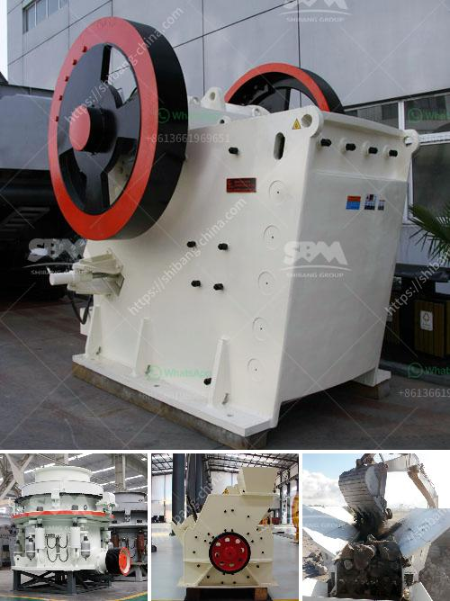

<h3>used silica crushing plants for sale</h3>
Silica, also known as silicon dioxide, is a key ingredient in many industrial applications. It is widely used in the fields of glass-making, ceramics, metallurgy, and foundry as a raw material or as a component in manufacturing processes. Silica is extracted from quartz, which is abundant in nature. As the demand for silica continues to grow, so does the need for effective processing equipment. Used silica crushing plants provide an affordable alternative for those looking to maximize their operational efficiency.

Silica crushing plants are used to process sand, gravel, and rock containing silica. These plants typically include crushers, screens, conveyors, and feeders, tailored to meet the specific needs of each customer. The crushing equipment used in silica plants include jaw crushers, cone crushers, impact crushers, and hammer crushers. These machines are designed to grind silica into smaller particles, which can then be used in various industrial applications.

One major advantage of purchasing used silica crushing plants is cost savings. Buying used equipment can be significantly cheaper than purchasing brand new machines. This is especially true for smaller businesses or startups with a limited budget. Additionally, used equipment allows for immediate availability, allowing businesses to quickly start their operations without waiting for new equipment to be manufactured and delivered.

Used silica crushing plants also offer a variety of options to choose from. Different types of crushers and screens can be used depending on the required final product size and the specific needs of the application. By selecting the appropriate equipment, businesses can ensure maximum productivity and efficiency, resulting in higher profits.

Furthermore, purchasing used silica crushing plants allows businesses to reduce their environmental impact. Instead of supporting the production of new equipment, reusing existing machines minimizes waste and energy consumption. This supports the principles of sustainability and responsible resource management. By opting for used equipment, businesses can play their part in reducing the environmental footprint of the industry.

When considering the purchase of used silica crushing plants, several factors should be taken into account. First and foremost, it is essential to inspect the equipment thoroughly. This includes assessing the condition of the crushers, screens, and other components to ensure they are in good working order. It is also recommended to consider the warranty or any maintenance support offered by the seller.

Secondly, businesses should evaluate the capacity and performance of the plant in relation to their production goals. The capacity of the crushers and screens should match the desired output requirements of the application. It is important to consult with experts or engineers to determine the right equipment specifications for the specific needs of the business.

Lastly, the reputation and credibility of the seller should be considered. This can be determined by reviewing customer testimonials or seeking recommendations from trusted sources. A reliable seller will provide accurate information about the used silica crushing plants, as well as offer support during the purchasing process and beyond.

In conclusion, used silica crushing plants offer an affordable and sustainable solution for businesses looking to expand or improve their production capabilities. The cost savings, wide range of options, and reduced environmental impact make them an attractive choice for many industries. When purchasing used equipment, it is crucial to conduct a thorough inspection, evaluate capacity and performance, and choose a reputable seller. By doing so, businesses can maximize their operational efficiency and profitability while minimizing their environmental footprint.
<h3>Contact us</h3><ul><li><strong>Whatsapp:&nbsp;<a href="https://wa.me/8613661969651">+8613661969651</a></strong></li><li><a href="https://swt.shibang-china.com/?git&amp;zhl&amp;used silica crushing plants for sale"><strong>Online Service(chat now)</strong></a></li></ul><h3>Related</h3><ul><li><a href='gypsum production powder manufacturers in europe.md'>gypsum production powder manufacturers in europe</a></li><li><a href='used mining equipment for sale in ghana.md'>used mining equipment for sale in ghana</a></li><li><a href='ston crusher machine in nigeria.md'>ston crusher machine in nigeria</a></li><li><a href='stone crusher plant indonesia.md'>stone crusher plant indonesia</a></li><li><a href='feldspar ball mills manufacturers.md'>feldspar ball mills manufacturers</a></li></ul>